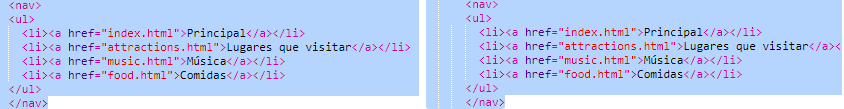

## Navegando por tu página web

Muchos sitios web tienen un menú de **navegación** para ayudar a los visitantes a moverse entre páginas. Ahora que tienes muchas páginas, una página de inicio y enlaces a cada una de ellas, movamos la lista de enlaces a la sección de navegación en la parte superior de cada una de las páginas.


- Encuentra el codigo para tu lista de enlaces que creaste en el paso anterior.

- Justo antes de la etiqueta de apertura `<ul>`, presione **Enter** para crear una nueva línea en blanco, a continuación, en la nueva línea, escriba la siguiente etiqueta: `<nav>`. Trinket agrega automáticamente la etiqueta de cierre inmediatamente después, pero puedes eliminarla —no está en el lugar correcto.

- Justo **después** de la etiqueta de apertura `</ul>`, presiona **Enter** para crear una nueva línea en blanco, y escribe la etiqueta de cierre `</nav>`.

- Ahora selecciona toda la sección `<nav>` y la lista haciendo clic justo antes de la etiqueta de apertura `<nav>` y arrastrando el mouse hasta el final justo después de la etiqueta de cierre `</nav>`, de modo que todo el texto, incluidas las etiquetas de apertura y cierre, se resalten. ¡Asegúrate de que todos los **corchetes angulares** `<` y `>` al inicio y al final también están resaltados!



- Vas a **cortar** esta vez en lugar de copiar. Mantén presionada la tecla <kbd>Ctrl</kbd> (o la tecla <kbd>cmd</kbd>), y mientras lo mantienes presionado, presiona la tecla <kbd>X</kbd>. El código resaltado desaparecerá, ¡pero no te asustes!

- En la parte superior del archivo, haga clic en el espacio entre `<header> </header>` etiquetas. Asegúrate de ver el cursor parpadeando allí. Ahora pega el código pulsando <kbd>Ctrl</kbd> (o <kbd>cmd</kbd>) y <kbd>V</kbd> como de costumbre. Tu código debería verse algo así:

```html
    <header>
        <nav>
            <ul>
            <li><a href="index.html"> Inicio </a></li>
            <li><a href="attractions.html"> Lugares para visitar </a></li>
            <li><a href="music.html"> Música </a></li>
            <li><a href="food.html"> Cosas para comer </a></li>
            </ul>
        </nav>
    </header>
```

--- collapse ---
---
title: Deshacer!
---

Si cometes un error, puedes **deshacer** presionando <kbd>Ctrl</kbd> (o <kbd>cmd</kbd>) y <kbd>Z</kbd> juntos. Por lo general, puedes presionar esta combinación de teclas varias veces para deshacer los últimos cambios. ¡Este es otro atajo del teclado práctico que se puede usar en muchos programas!

--- /collapse ---

- Prueba tus enlaces para asegurarte de que sigan funcionando.

--- challenge ---

## Desafío: menús de navegación para todas las páginas

- Coloca esta sección de código en la sección de encabezado de cada archivo HTML que hayas creado. Esto hará que el menú de navegación aparezca en la parte superior de cada página de tu sitio web.
    
--- hints ---

    
--- hint ---

Hint ---Selecciona toda la sección `<nav>` como hiciste antes, y presiona las teclas <kbd>Ctrl</kbd> (o <kbd>cmd</kbd>) y <kbd>C</kbd> a la vez para copiarla.

Luego, en cada uno de tus archivos `.html`, haz clic dentro de la sección `<header> </header>` y pega el código exactamente como lo hiciste anteriormente.

--- /hint ---

--- /hints ---

Ahora podrás hacer clic en los enlaces sin importar en qué página te encuentres.

--- /challenge ---