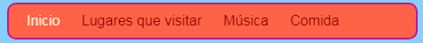
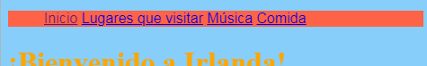
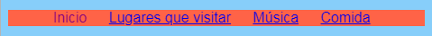

## Haciendo un menú de barra

En esta tarjeta podrás ver cómo puedes transformar tu menú de navegación en una barra de menú de aspecto fresco, simplemente añadiendo más reglas CSS en la hoja de estilo.



- Ve al archivo de hojas de estilo en la pestaña `styles.css`. Haga clic en ** debajo ** de una llave de cierre `} ` y presione ** Enter ** para crear una nueva línea en blanco. Agregue el siguiente código de CSS:

```css
    nav ul {
        background-color: tomato;
    }
```

¿Te das cuenta de cómo usaste dos selectores en lugar de uno? Si usaste el selector ` ul ` por sí solo, la regla afectaría todas las listas desordenadas en su sitio web. Agregar el selector ` nav ` también hace que solo se aplique a listas que se encuentren entre las etiquetas ` nav `.


Vamos a deshacernos de los puntos de bala. Esos son los puntos delante de cada elemento de la lista.

- Añade el siguiente código CSS al archivo `styles.css`. Again, type it on a new line after a `}` so it's not inside any other block of rules.

```css
    nav ul li {
        list-style-type: none;
    }
```

Notice this set of rules has three selectors: it selects all `li` elements that are in a `ul` list which is inside a `nav` section. Phew!


Now let's make the list horizontal (across) instead of vertical (down).

- Inside the new CSS rule you just created, add the following line: `display: inline;`.



- The menu items are now all squashed together, so let's also add the properties `margin-right` and `margin-left` to space them out a bit. The block of CSS code should look like this now:

```css
    nav ul li {
        list-style-type: none;
        display: inline;
        margin-right: 10px;
        margin-left: 10px;
    }
```

Recuerde: `10px` significa diez píxeles.

¿Qué te parece hacer que el menú cambie para decirte en qué página estás? Esta parte no estará en la hoja de estilo.

- Comience con la página de inicio. Ve al archivo `index.html`. En la lista de enlaces del menú, elimine las etiquetas de enlace antes y después de la palabra ` Inicio`, de modo que el elemento de la lista para la página de inicio sea solo texto entre `<li> </li>` etiquetas, como esta: `<li> Inicio </li>` .

- Ahora vaya a cada uno de tus otros archivos y haga lo mismo, eliminando las etiquetas de enlace en la página que estás editando. Así que, por ejemplo, en el archivo `music.html` he eliminado las etiquetas de enlace en el elemento de la lista `Música`

```html
    <header>
        <nav>
            <ul>
            <li><a href="index.html">Home</a></li>
            <li><a href="attractions.html">Places to visit</a></li>
            <li>Music</li>
            <li><a href="food.html">Things to eat</a></li>
            </ul>
        </nav>
    </header>
```

- Explore sus páginas haciendo clic en los enlaces. ¿Ver cómo la barra de menú muestra la página en la que estás como texto plano en lugar de un enlace? 



En la siguiente tarjeta, aprenderá aún más trucos de CSS para que la barra de menú se vea increíble.