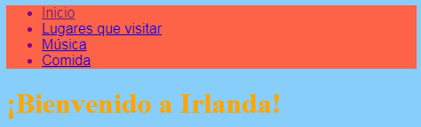
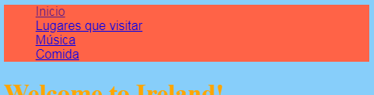

## Haciendo un menú de barra

En esta tarjeta podrás ver cómo puedes transformar tu menú de navegación en una barra de menú de aspecto fresco, simplemente añadiendo más reglas CSS en la hoja de estilo.


- Ir al archivo de hojas de estilo en la pestaña `styles.css`. Click **below** a closing curly brace `}`, and press **Enter** to create a new blank line. Add the following CSS rule:

```css
    nav ul {
        background-color: tomato;
    }
```

Notice how you used two selectors instead of one? If you used the `ul` selector on its own, the rule would affect all unordered lists on your website. Adding the `nav` selector as well makes it only apply to lists that are in between `nav` tags.



Let's get rid of the bullet points. Those are the dots in front of each list item.

- Add the following to the `styles.css` file. Again, type it on a new line after a `}` so it's not inside any other block of rules.

```css
    nav ul li {
        list-style-type: none;
    }
```

Notice this set of rules has three selectors: it selects all `li` elements that are in a `ul` list which is inside a `nav` section. Phew!



Now let's make the list horizontal (across) instead of vertical (down).

- Inside the new CSS rule you just created, add the following line: `display: inline;`.


- The menu items are now all squashed together, so let's also add the properties `margin-right` and `margin-left` to space them out a bit. The block of CSS code should look like this now:

```css
    nav ul li {
        list-style-type: none;
        display: inline;
        margin-right: 10px;
        margin-left: 10px;
    }
```

Recuerde: `10px` significa diez píxeles.

¿Qué te parece hacer que el menú cambie para decirte en qué página estás? Esta parte no estará en la hoja de estilo.

- Comience con la página de inicio. Ve al archivo `index.html`. En la lista de enlaces del menú, elimine las etiquetas de enlace antes y después de la palabra ` Inicio`, de modo que el elemento de la lista para la página de inicio sea solo texto entre `<li> </li>` etiquetas, como esta: `<li> Inicio </li>` .

- Ahora vaya a cada uno de tus otros archivos y haga lo mismo, eliminando las etiquetas de enlace en la página que estás editando. So, for example, on the `music.html` file, I've removed the link tags in the `Music` list item:

```html
    <header>
        <nav>
            <ul>
            <li><a href="index.html">Home</a></li>
            <li><a href="attractions.html">Places to visit</a></li>
            <li>Music</li>
            <li><a href="food.html">Things to eat</a></li>
            </ul>
        </nav>
    </header>
```

- Explore your pages by clicking the links. See how the menu bar shows the page you're on as plain text instead of a link? 


On the next card you'll learn even more CSS tricks to make the menu bar look awesome.