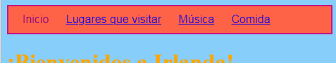
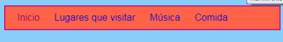
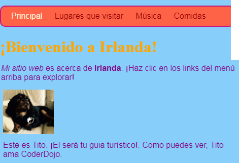

## Dando estilo a la barra de menú

Con CSS, las posibilidades de hacer que tu barra de menú parezca genial son infinitas.

- Vuelve al archivo `styles.css` —!el lugar donde suceden las cosas interesantes!

- Encuentra tu selector `nav ul` y añade más reglas para se vea así:

```css
  nav ul {
    background-color: tomato;
    border-style: solid;
    border-color: MediumVioletRed;
    border-width: 2px;
    padding: 10px;
  }
```

La propiedad `padding` añade espacio. ¿Puede averiguar qué hacen cada una de las otras propiedades? Prueba experimentando con diferentes colores y números de píxeles.



- Para deshacerse del subrayado de los enlaces, agregue el siguiente código en una nueva línea después de la llave de cierre `} ` para la regla ` nav ul li `. Puedes ponerlo después de cualquier `}`, ¡pero es una buena idea mantener juntos los temas relacionados para que sea más fácil de encontrar!

```css
  nav ul li a {
      text-decoration: none;
  }
```

La regla anterior se aplica a los enlaces `<a>` dentro de los elementos de la lista `<li>` en una lista no ordenada `<ul>` dentro de una sección de navegación `<nav>`. ¡Wow, esos son cuatro selectores!



¿Recuerdas cómo eliminaste las etiquetas de enlace de algunos elementos de la lista en `<nav>` para poder ver fácilmente en qué página te encuentras? ¿Por qué no cambiar también el color del texto de los elementos de la lista de navegación que no son enlaces?

- Encuentra tu selector ` nav ul li `, y ** dentro ** de las llaves añade la línea:

```css
  color: PapayaWhip;
```

¡Puedes elegir cualquier color que quieras!

Puedes añadir la propiedad `color` a la regla `nav ul li a` también si quieres que los enlaces de menú sean un color diferente de otros enlaces de tu sitio web.

- ¿Qué tal algunas esquinas redondeadas para su menú? Intenta agregar el siguiente código a la regla ` nav ul ` para ver qué sucede: ` border-radius: 10px; `.

¡La propiedad `border-radius` es una forma realmente fácil de hacer que cualquier cosa luzca mucho más cool!



\--- challenge \---

## Desafío: haz que tus fotos tengan esquinas redondeadas

- En tu hoja de estilos, crea un nuevo conjunto de reglas para las imágenes utilizando el selector `img` y añade una regla `border-radius` allí.

\--- /challenge \---