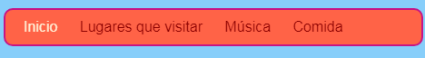

## Definiendo el estilo del menú de barra

Con CSS, las posibilidades de hacer que tu barra de menú parezca genial son infinitas.

- Vuelve al archivo `styles.css` —el lugar donde suceden las cosas interesantes!

- Encuentra tu selector `nav ul` y añade más reglas para se vea así:

```css
  nav ul {
    background-color: tomato;
    border-style: solid;
    border-color: MediumVioletRed;
    border-width: 2px;
    padding: 10px;
  }
```

La propiedad `padding` añade espacio. ¿Puede averiguar qué hacen cada una de las otras propiedades? Prueba experimentando con diferentes colores y números de píxeles.


- Para deshacerse del subrayado de los enlaces, agregue el siguiente código en una nueva línea después de la llave de cierre `} ` para la regla ` nav ul li `. Puedes ponerlo después de cualquier `}`, ¡pero es una buena idea mantener juntos los temas relacionados para que sea más fácil de encontrar!

```css
  nav ul li a {
      text-decoration: none;
  }
```

La regla anterior se aplica a los enlaces `<a>` dentro de los elementos de la lista `<li>` en una lista no ordenada `<ul>` dentro de una sección de navegación `<nav>`. ¡Wow, esos son cuatro selectores!


Remember how you removed the link tags from some list items in the `<nav>` so you can easily see what page you're on? Why not also change the text colour of those navigation list items which are not links!

- Find your `nav ul li` selector, and **inside** the curly braces add the line:

```css
  color: PapayaWhip;
```

¡Puedes elegir cualquier color que quieras!

You can add the `color` property to the `nav ul li a` rule as well if you want the menu links to be a different colour from other links on your website.

- How about some rounded corners for your menu? Try adding the following code to the `nav ul` rule to see what happens: `border-radius: 10px;`.

The `border-radius` property is a really easy way to make anything look cooler!



\--- challenge \---

## Desafío: haz que tus fotos tengan esquinas redondeadas

- In your style sheet, create a new set of rules for pictures using the `img` selector, and add in a `border-radius` rule there.

\--- /challenge \---