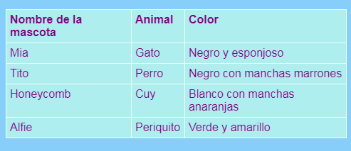

## Añadiendo una tabla

A veces puede ser útil mostrar información en una tabla. Por ejemplo, es posible que desees incluir información en tu sitio web sobre los miembros de un club deportivo o un colegio, o información sobre tus diez canciones favoritas.

Una tabla es una cuadrícula formada por **filas** y **columnas**. La mayoría de las tablas también incluyen títulos en la parte superior de cada columna, llamados **encabezado**. Aquí tienes un ejemplo:



- Ve al archivo `page_with_table.html`. Allí verás un montón de código entre las etiquetas `<table> </table>`.

- Selecciona todo el código desde el comienzo de la etiqueta `<table>` hasta el final de la etiqueta de cierre `</table>` y cópialo. Luego ve a uno de tus archivos donde te gustaría poner una tabla y pega el código.

En este momento tu tabla está vacía.

- ¡Intenta llenar tu tabla con lo que quieras! Simplemente coloca texto entre las etiquetas `<td> </td>` y entre las etiquetas `<th> </th>`. Puedes añadir más etiquetas si las necesitas.

--- collapse ---
---
title: Código de ejemplo
---

El código HTML para la tabla que se muestra arriba se ve así:

```html
  <table>
    <tr>
      <th>Nombre de la mascota</th>
      <th>Animal</th>
      <th>Color</th>
    </tr>
    <tr>
      <td>Mia</td>
      <td>Gato</td>
      <td>Negro y esponjoso</td>
    </tr>
    <tr>
      <td>Tito</td>
      <td>Perro</td>
      <td>Negro con manchas marrones</td>
    </tr>
    <tr>
      <td>Hamtaro</td>
      <td>Cuy</td>
      <td>Blanco con manchas anaranjadas</td>
    </tr>
    <tr>
      <td>Alfie</td>
      <td>Periquito</td>
      <td>Verde y amarillo</td>
    </tr>
  </table>
```

--- /collapse ---

Para agregar otra **fila**, añade otro conjunto de etiquetas `<tr> </tr>`. Entre ellas, coloca el mismo número de **datos** con etiquetas `<td> </td>` que tiene en las otras filas.

Para añadir otra **columna**, agrega un elemento de **datos** adicional con un conjunto de etiquetas `<td> </td>` a **cada** fila. Agrega también un elemento de **encabezado** adicional a la primera fila, usando las etiquetas `<th> </th>`.

--- collapse ---
---
title: ¿Cómo funciona?
---

Echemos un vistazo a todas esas etiquetas. Es un poco como el código de una lista (recuerda `<ul>` y `<ol>`) pero con más niveles.

Cada par de etiquetas `<tr> </tr>` es una fila, por lo que todo lo que se encuentre entre ellas se mostrará en una línea.

La primera fila contiene etiquetas `<th> </th>`. Estas se utilizan para los encabezados, por lo que los títulos de las columnas van entre ellos. Hay un par por cada columna que tienes en tu tabla.

Las etiquetas `<td> </td>` definen como serán llamados los datos de la tabla y lo que ocurrirá en todas las otras filas. Son similares a las etiquetas de elementos de la lista `<li> </li>`: todo lo que hay entre ellos es un elemento en la fila de la tabla.

--- /collapse ---

- Si observas el final del archivo `styles.css` verás el código CSS que describe cómo lucirá la tabla. ¡No tienes que entenderlo todo! Pero puedes experimentar cambiando el texto, el borde y los colores de fondo para diseñar tu propio estilo.

```css
  table, th, td {
    border: 1px solid HoneyDew;
    border-collapse: collapse;
  }
  tr {
    background-color: PaleTurquoise;
  }
  th, td {
    vertical-align: top;
    padding: 5px;
    text-align: left;
  }
  th {
    color: purple;
  }
  td {
    color: purple;
  }
```

Observa cómo algunos de los selectores usan comas, por ejemplo, ¿`table, th, td`? Esa es una **lista de selectores**: significa que se aplica a todos los elementos `<th>` y todos los elementos `<td>`. ¡Ahorra escribir el mismo conjunto de reglas para cada selector!