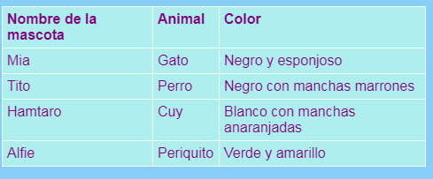

## Agregando una tabla

A veces puede ser útil mostrar información en una tabla. Por ejemplo, es posible que desees incluir información sobre los miembros en un sitio web de un club deportivo local o escuela, o información sobre tus diez canciones favoritas.

Una tabla es una cuadrícula compuesta de ** filas ** y ** columnas **. Most tables also include titles at the top of each column, called the **header**. Aquí está un ejemplo:



- Ve al archivo ` page_with_table.html `. Allí verá un montón de código entre etiquetas `<table> </table>`.

- Select all of the code from the start of the `<table>` tag to the end of the closing `</table>` tag and copy it. Then go to one of your files where you would like to put a table, and paste in the code.

En este momento su tabla está vacía.

- ¡Intenta llenar tu tabla con lo que quieras! Simplemente ponga texto entre `<td> </td>` etiquetas y entre las etiquetas `<th> </th>`. Puedes añadir más etiquetas si las necesitas.

## \--- collapse \---

## title: código de ejemplo

El código HTML para la tabla que se muestra arriba se ve así:

```html
  <table>
    <tr>
      <th>Nombre de la mascota</th>
      <th>Animal</th>
      <th>Color</th>
    </tr>
    <tr>
      <td>Mia</td>
      <td>Gato</td>
      <td>Negro y esponjoso</td>
    </tr>
    <tr>
      <td>Tito</td>
      <td>Perro</td>
      <td>Negro con manchas marrones</td>
    </tr>
    <tr>
      <td>Hamtaro</td>
      <td>Cuy</td>
      <td>Blanco con manchas anaranjadas</td>
    </tr>
    <tr>
      <td>Alfie</td>
      <td>Periquito</td>
      <td>Verde y amarillo</td>
    </tr>
  </table>
```

\--- /collapse \---

To add another **row**, add another set of `<tr> </tr>` tags. In between them, you put the same number of **data** items with `<td> </td>` tags as you have in the other rows.

To add another **column**, add an extra **data** item with a set of `<td> </td>` tags to **every** row. Also add an extra **header** item to the first row, using `<th> </th>` tags.

## \--- collapse \---

## title: ¿Cómo funciona?

Let's have a look at all those tags. It's a bit like the code for a list (remember `<ul>` and `<ol>`) but with more levels.

Each pair of `<tr> </tr>` tags is a row, so everything in between them will be displayed on one line.

The first row contains `<th> </th>` tags. These are used for the headers, so the column titles go in between them. There is one pair for each column you have in your table.

The `<td> </td>` tags define what's called table data, and that's what goes in all the other rows. These are similar to the list item tags `<li> </li>`: everything in between them is one item in your table row.

\--- /collapse \---

- If you look at the end of the `styles.css` file, you will see the CSS code that describes how the table should look. You don't have to understand all of it! But you can experiment with changing the text, border, and background colours to design your own style.

```css
  table, th, td {
    border: 1px solid HoneyDew;
    border-collapse: collapse;
  }
  tr {
    background-color: PaleTurquoise;
  }
  th, td {
    vertical-align: top;
    padding: 5px;
    text-align: left;
  }
  th {
    color: purple;
  }
  td {
    color: purple;
  }
```

Notice how some of the selectors use commas, for example `table, th, td`? That's a **list of selectors**: it means it applies to all `<th>` elements and all `<td>` elements. It saves typing out the same set of rules for each selector!