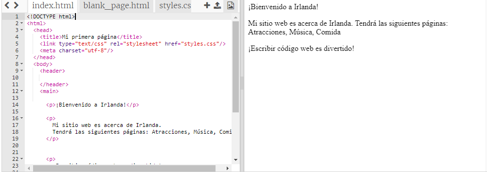

## Preparación

- Ve [al trinket inicial](http://dojo.soy/html-b-start). Encontrarás un cuadro que contiene un proyecto de sitio web de ejemplo. A la derecha está el sitio web, y a la izquierda está el código que hace el sitio web. 

## \--- collapse \---

## title: Ya tengo una cuenta de Trinket

- Haz click en el botón de **Remix** en la parte superior derecha del proyecto. Si no has iniciado sesión, se te pedirá que lo hagas. Una vez que hayas iniciado sesión, deberás hacer click en **Remix** nuevamente. Al hacer click en este botón se hará una copia del proyecto con la que podrás trabajar. 

Debería decir **remixed** después de hacer clic en él:

\--- /collapse \---

## \--- collapse \---

## title: No tengo una cuenta de Trinket

Puedes guardar tu trabajo utilizando una de las opciones en el menú **Compartir**. Obtendrás un enlace que podrás guardar en donde gustes, por ejemplo, en un documento, o enviárselo por correo a alguien. **Nota:** cada vez que haces un cambio, obtendrás un nuevo enlace.

Si quieres crear una cuenta en Trinket, sigue los pasos a continuación. Esto te permitirá acceder fácilmente a tu trabajo desde cualquier ordenador, y a hacer **remix** a proyectos que otra persona haya compartido contigo (es decir, guardar una copia para poder hacer cambios. Remixar significa que guardarás una copia de un proyecto para poder hacer tus propios cambios.

- Ve al [sitio web de Trinket](http://dojo.soy/trinket) y haz click en **Sign Up For Your Free Account**. Necesitarás una dirección de correo electrónico para registrarte.

- Ingresa tu dirección de correo electrónico y elige una contraseña, o pide a alguien que lo haga por ti.

- Ahora puedes acceder a todos tus proyectos guardados o remixados haciendo clic en tu nombre de usuario y yendo a **My Trinkets**. 

\--- /collapse \---

¡Empecemos a programar!