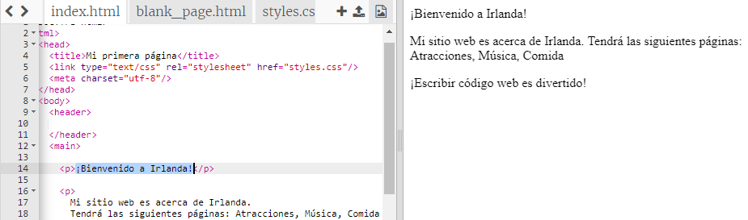
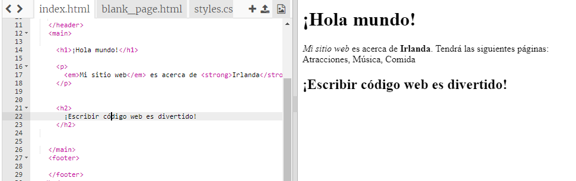

## ¡Tu primera página web!

- En el panel de la izquierda, el **panel de código**, haz clic en la pestaña llamada `index.html`.

- Encuentra la línea que dice `Bienvenido a Irlanda!` y cámbialo por tu propio mensaje. Ten cuidado de **no** eliminar las etiquetas `<p>` al comienzo de la línea y `</p>` al final de la línea. Deberías poder ver tu página web actualizada en el panel de la derecha.



- Ahora en la misma línea, cambia las etiquetas `<p>` y `</p>` por `<h1>` y `</h1>`. ¿Notas algún cambio en el resultado a la derecha?

```html
  <h1> ¡Bienvenido a Irlanda! </h1>
```

--- collapse ---
---
title: explicación de HTML y etiquetas
---

**HTML** es el código que conforma una página web.

El `.html` en el nombre del archivo le dice al navegador que el archivo es una página web, por lo que el navegador sabe que tiene que buscar **etiquetas** que le indiquen qué tiene que mostrar. (Un navegador es el programa que utilizas para ver sitios web, como por ejemplo, Chrome o Firefox)

Las etiquetas HTML como `<p>` y `</p>` definen diferentes partes de una página, como por ejemplo párrafos, encabezados o el cuerpo. Estas partes se llaman **elementos**. Piensa en ellos como si fueran bloques de construcción.

### ¿Por qué necesito dos etiquetas?

Es necesario una etiqueta de **abertura** y otra de **de cierre** para indicarle al navegador dónde **empiezan** y **acaban** los elementos. Por lo tanto, para un párrafo, la etiqueta de apertura `<p>` indica "Aquí viene un texto que quiero que se muestre como un párrafo". La etiqueta de cierre `</p>` le dice al navegador dónde termina el párrafo.

Todo lo que se encuentra entre las etiquetas `<body>` y `</body>` es tu página web.

- Fíjate cómo la etiqueta de cierre **siempre** tiene una barra inclinada `/`.

--- /collapse ---

- Intenta cambiar los números en las etiquetas de tu **encabezado** para ver los distintos tamaños que te dan. Pueden ir desde `<h1>` hasta `<h6>`. Recuerda cambiar tanto la etiqueta de apertura como la de cierre para que coincidan.

- Encuentre el código para el párrafo que dice `Mi página web es sobre Irlanda.` y cámbialo para que se vea así:

```html
  <p>
    <em>Mi página web</em> es sobre <strong>Irlanda</strong>. 
    Tendrá las siguientes páginas: Atracciones, Música, Comida
  </p>
```

¿Puedes descifrar lo que las etiquetas `<em> </em>` y `<strong> </strong>` hacen?



--- challenge ---

## Desafío: agrega más texto propio

- Intenta agregar un nuevo párrafo o encabezado a tu página usando algunas de las etiquetas que has aprendido.

--- hints ---


--- hint ---

Hint ---Cuando desees colocar texto en una página, deberás colocarlo entre dos etiquetas que le indiquen a tu navegador cómo mostrar tu texto. Por ejemplo, las etiquetas `<p> </p>` indican al navegador que lo que está entre ellas es un nuevo párrafo de texto y las etiquetas `<h1> </h1>` indican que el texto intermedio es un encabezado.

--- /hint ---

--- hint ---

El código para los párrafos se ve así:

```html
  <p>Este es un párrafo de texto.</p>

  <p>Este es otro párrafo.
  Todo lo que se encuentra entre un par de etiquetas p se muestra 
  en una larga línea en la página web.</p>
```

--- /hint ---

--- hint ---

El código para los encabezados se ve así:

```html
  <h1>Este es un encabezado.</h1>
```

Normalmente, los encabezados se mostrarán más grandes o más destacadas que los párrafos.

--- /hint ---

--- /hints ---

--- /challenge ---

¡Felicidades, has construido tu primera página web! En la siguientes páginas, descubrirás cómo controlar cómo se ve.