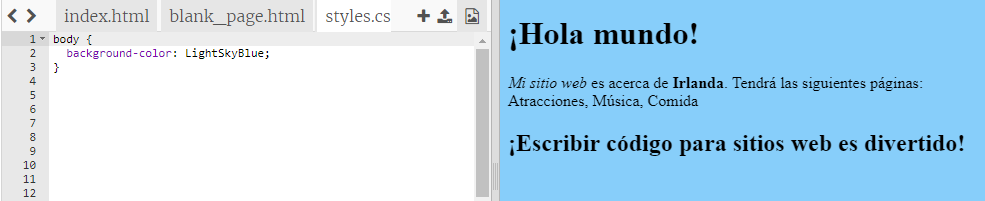
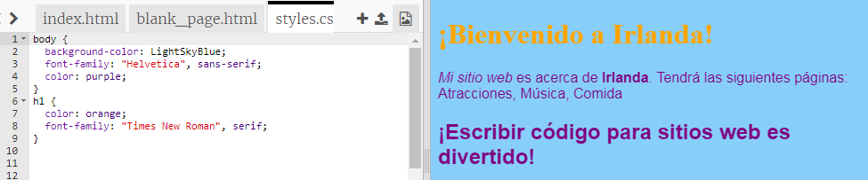

## Controlando cómo se ve

El código que describe como un sitio web se llama **CSS**.

- Mira las pestañas en la parte superior del panel de código, y ve al archivo `styles.css` haciendo clic en la pestaña con ese nombre. El archivo contiene el siguiente texto:

```css
  body {
      background-color: white;
  }
```

- Cambiar el ` blanco ` color a ` LightSkyBlue ` y mira lo que pasa. ¡Tu sitio web debe tener un fondo azul! 



## \--- collapse \---

## title: ¿Cómo funciona?

Si observas la parte superior del archivo `index.html` verás la siguiente línea:

```html
  <link type="text/css" rel="stylesheet" href="styles.css"/>
```

La línea anterior indica al navegador que busca un archivo especial llamado `styles.css`. Este archivo especial se llama** hojas de estilo**. Puedes reconocer un archivo de hoja de estilo por el `.css` en su nombre.

Una hoja de estilo contiene **reglas** para el cómo debería lucir cada elemento en tu página web.

Las llaves `{ }` y el código entre ellas son un conjunto de ** reglas de CSS ** . La palabra `body (cuerpo)` significa que las reglas son para todos los elementos de `< body>` en tu sitio web. Llamamos al pedacito delante de las llaves como **selector**. Entonces, en este caso, es el selector para los elementos del cuerpo.

Cada regla dentro de las llaves se compone de:

- Una **propiedad ** a la izquierda, seguido de un símbolo de dos puntos `: `
- Un **valor** para la propiedad en el lado derecho después de los dos puntos
- Un símbolo de punto y coma `;` al final

\--- /collapse \---

- Agreguemos reglas para cambiar la apariencia del texto. Agregue dos nuevas líneas dentro de las llaves:

```css
  body {
    background-color: LightSkyBlue;
    font-family: "Helvetica", sans-serif;
    color: purple;
  }
```

Mira cómo esto ha cambiado la página web.

La propiedad `color` siempre es para texto. Aquí, estás configurando el color de todo el texto en el `body` (cuerpo) de tu página web.

- También puede escribir reglas separadas para los encabezados y los párrafos. Para encabezados `<h1>`, utiliza el selector` h1`. Debajo de la llave de cierre que contiene la regla CSS para el cuerpo, agregue el siguiente código.

```css
  h1 {
    color: orange;
    font-family: "Times New Roman", serif;
  }
```

Your heading text should be orange now, with the paragraph in purple as before.



Notice how the letters also look different as well as being a different colour? This is because you changed their **font family**. You can find some more fonts [here](http://dojo.soy/web-font-families).

- Try adding a set of rules for the `<h2>` headings, using the `h2` selector.

- Why not experiment with different colour combinations for the text and background? There are lots of colours available to use. Find a full list of them [here](http://dojo.soy/web-color-names).