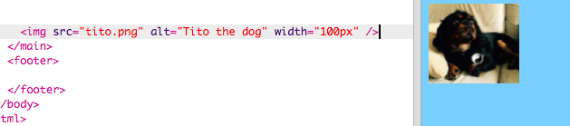

## Agregando imágenes

¡Agreguemos una foto!

- Vaya a la pestaña llamada ` index.html ` . Encuentra la etiqueta ` </main>` y escriba lo siguiente ** arriba**: 

```html
    
```

Así es como debería verse el resultado:



Ten en cuenta que esta etiqueta tiene información adicional en su interior. Se llaman **atributos**.

- Encuentra el bit de código que dice `width="100px"` e intenta experimentar con diferentes números para ver si puedes averiguar lo que hace este atributo. ¡No borres las letras `px`!

\--- collapse \---

* * *

## título: Cómo funciona la etiqueta `img`

Notice that the `` tag is different from the other tags you've used so far — there is no closing `</img>` tag. Instead, this tag is **self-closing**: it has `/>` at the end. This is because there is no 'start' and 'end' to an image element like there is for text on the page.

The tag contains **attributes** with extra information:

- The `src` attribute tells the browser what file to use for the picture. 
- The `alt` attribute is a short description that the browser will show if it cannot display the picture. 'alt' is short for 'alternative'. This text also helps people using a screen reader to know what the picture is.
- The `width` attribute tells the browser how wide to make the picture. `100px` means one hundred **pixels**, which are the tiny dots that make up what you're seeing on your screen. If you don't include this attribute, the picture will be displayed in its original size.

\--- /collapse \---

Now that you know the code to put a picture on your website, you probably want to change the picture, right?

- The first thing you will need is, of course, a picture! You can either use one you've already got on your computer, such as a photograph you took, or you can get one from the internet.

[[[generic-get-picture-from-web]]]

**Note:** not all images you will find on the internet are free for anyone to use. If you download a picture, you should make sure it is one that you are allowed to use. Find out more about this here:

[[[images-permissions-to-use]]]

Once you have a picture, you can **upload** the file to Trinket:

- In your trinket, click on the **image** icon next to the **+** sign. 


This is where you can see the pictures that you are able to use on your website. You should see the picture of Tito, the CoderDojo dog.

- Click the button **Add Image** and then click **Upload**.

- Click on the button **Click To Select Files**. Find and double-click your image file in the window that opens.

- Click **Done**.


Your picture will be uploaded and should be ready to use.

- Go to the file `index.html` and find the `` tag. Change the text `tito.png` so that it exactly matches the name of the image file you've chosen. Note that its name might end in `.jpg` instead of `.png`!

The text you just changed is the attribute called `src`, which tells the browser which file to display.

**Note:** the value you type for an attribute must have quotation marks `""` around it!

\--- challenge \---

## Challenge: change the alt text of the picture

- Find the `alt` attribute of your image element and change the text in it to a short description of your picture. 

\--- /challenge \---