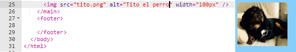

## Agregando imágenes

¡Agreguemos una foto!

- Vaya a la pestaña llamada ` index.html ` . Encuentra la etiqueta ` </main>` y escriba lo siguiente ** arriba**: 

```html
    
```

Así es como debería verse el resultado:



Ten en cuenta que esta etiqueta tiene información adicional en su interior. Se llaman **atributos**.

- Encuentra el bit de código que dice `width="100px"` e intenta experimentar con diferentes números para ver si puedes averiguar lo que hace este atributo. ¡No borres las letras `px`!

## \--- collapse \---

## title: How the `img` tag works

Notice that the `` tag is different from the other tags you've used so far — there is no closing `</img>` tag. Instead, this tag is **self-closing**: it has `/>` at the end. This is because there is no 'start' and 'end' to an image element like there is for text on the page.

The tag contains **attributes** with extra information:

- El atributo `src` le dice al navegador qué archivo usar para la imagen. 
- El atributo `alt` es una descripción corta que el navegador mostrará si no puede mostrar la imagen. 'alt' es la abreviación de 'alternativo'. Este texto también ayuda a las personas que usan un lector de pantalla para saber qué es la imagen.
- El atributo `width` le dice al navegador qué tan ancha hacer la imagen. `100px` significa cien **pixels**, que son los puntos diminutos que conforman lo que estás viendo en tu pantalla. Si no incluyes este atributo, la imagen se mostrará en su tamaño original.

\--- /collapse \---

Now that you know the code to put a picture on your website, you probably want to change the picture, right?

- Lo primero que necesitarás es, por supuesto, ¡una foto! Puedes usar una que ya tengas en tu computadora, como una fotografía que hayas tomado, o puedes obtener una de Internet.

[[[generic-get-picture-from-web]]]

**Note:** not all images you will find on the internet are free for anyone to use. If you download a picture, you should make sure it is one that you are allowed to use. Find out more about this here:

[[[images-permissions-to-use]]]

Once you have a picture, you can **upload** the file to Trinket:

- En tu Trinket, haz clic en el icono de **image** junto al signo **+**. 


This is where you can see the pictures that you are able to use on your website. You should see the picture of Tito, the CoderDojo dog.

- Haga clic en el botón ** Agregar imagen ** y luego haga clic en ** Subir **.

- Haga clic en el botón **Clic para seleccionar archivos**. Encuentra y haz doble clic en el archivo de imagen en la ventana que se abre.

- Haga clic en ** Listo **.


Your picture will be uploaded and should be ready to use.

- Ve al archivo `index.html` y encuentra la etiqueta ``. Cambia el texto `tito.png` para que coincida exactamente con el nombre del archivo de imagen que has elegido. Tenga en cuenta que el nombre puede terminar en `.jpg ` en lugar de `.png `!

The text you just changed is the attribute called `src`, which tells the browser which file to display.

**Note:** the value you type for an attribute must have quotation marks `""` around it!

\--- challenge \---

## Challenge: change the alt text of the picture

- Encuentra el atributo `alt` de tu elemento de imagen y cambia el texto a una breve descripción de tu imagen. 

\--- /challenge \---