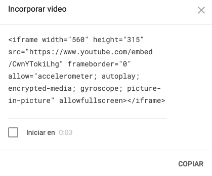
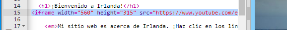
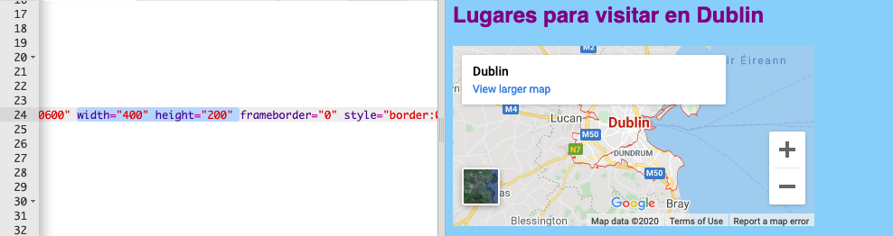

## Añadiendo un mapa o video

YouTube proporciona una manera fácil de agregar sus videos a tu sitio web. Añadir elementos de otras fuentes en línea a su sitio web también se llama **embedding**.

- Encuentre un video en YouTube que quieras mostrar en tu sitio web.

- Haz clic en el botón **Compartir** debajo del video. Seleccione la opción **Embed**.

Verás un cuadro de texto con todo el texto seleccionado. Si deselecciona accidentalmente el texto, puede seleccionarlo nuevamente haciendo clic en él y presionando las teclas <kbd> Ctrl </kbd> (o <kbd> cmd </kbd> en una Mac) y <kbd> A </kbd> al mismo tiempo.

- Presione las teclas <kbd> Ctrl </kbd> (o <kbd> cmd </kbd> en una Mac) y <kbd> C </kbd> juntas para copiar el texto.

- Luego regresa al a código HTML de tu págna web y haz clic en el lugar donde quieres poner el video, por ejemplo debajo de un encabezado o párrafo. **Pega** el código presionando <kbd>Ctrl</kbd> (o <kbd>cmd</kbd> en un Mac) y <kbd>V</kbd> en el teclado al mismo tiempo. ¡No te preocupes por entender todo el código que acaba de pegar!

Deberías ver el video aparecer en tu página web.

La misma técnica funciona también para Google maps. ¡Pruébalo!

- Ve [aquí](http://dojo.soy/google-maps) y busca un lugar que quieras mostrar en tu sitio web. **Nota:** **no** compartas información personal como tu domicilio en un sitio web!

- Haz clic en el resultado, luego haz clic en ** Compartir ** y copia el código y agrégalo a tu sitio web como se indica arriba. 

- If you look carefully, you should find `width` and `height` **attributes** in the pasted code. You can change their values to make the map appear bigger or smaller.

