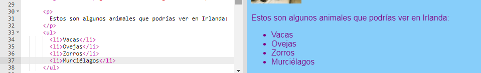
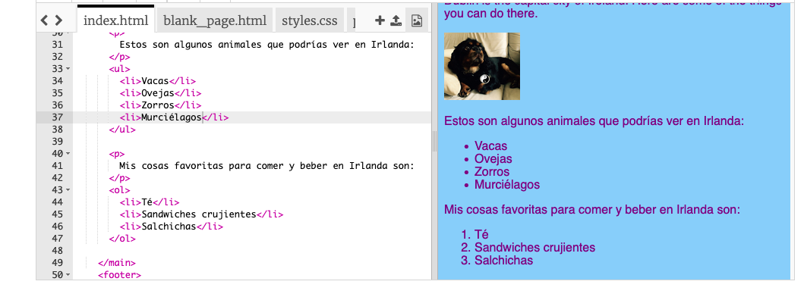

## Crear una lista

Ahora aprenderás cómo convertir una lista de elementos, tales como "unicornios, robots, gatos", en una lista con aspecto más agradable con la que podrás hacer cosas geniales más adelante.

- En el archivo `index.html`, agrega el código siguiente justo encima de la línea con la etiqueta `</main>` en él:

```html
    <ul>
        <li>Vacas</li>
        <li>Oveja</li>
        <li>Zorros</li>
        <li>Murciélagos</li>
    </ul>
```

El resultado debe ser una lista como esta:



Observe que hay un par separado de etiquetas `<li> </li>` alrededor de cada elemento en la lista.

Esta es una lista de algunos animales que se pueden ver en Irlanda. Puedes cambiar los elementos de la lista a cosas que tengan sentido para tu sitio web, y si quieres ¡puedes añadir un párrafo arriba de la lista para describir de qué es!

¿Qué tal si quisieras una lista numerada? Es casi lo mismo, pero en lugar de `<ul>`, usas `<ol>`. Una lista numerada también se le llama lista **ordenada**.

- Añade el siguiente código debajo del código que acabas de escribir — ¡asegúrate de que esté **debajo** de la etiqueta `</ul>`!

```html
    <p>
        Mis cosas favoritas para comer y beber en Irlanda son:
    </p>
    <ol>
        <li>Té</li>
        <li>Emparedados crujientes</li>
        <li>Salchichas</li>
    </ol>
```

Así es como debería verse ahora:



\--- challenge \---

## Desafío: agrega estilo a tus listas

- Mira si puedes agregar ** reglas CSS ** a tu hoja de estilo para cambiar el aspecto de tus listas.

\--- /challenge \---