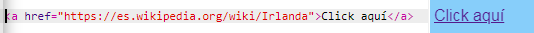

## Creando enlaces

En esta tarjeta, aprenderá cómo hacer un enlace que lo lleve a otra página al dar clic.

- Agregue el siguiente código a la sección del cuerpo de `index.html`:

```html
  <a href=""> Haga clic aquí </a>
```

Las etiquetas `<a> </a>` convierten en un enlace lo que está entre ellos.

- Intenta hacer clic en el enlace para ver qué sucede. No hace nada, ¿verdad?

Es porque el atributo `href` esta vacío por el momento. Debe contener el **URL** (dirección web) de la página a la que quiere vincularse.

- Ve a Wikipedia y busca una página sobre algo en tu sitio web. Voy a usar la página sobre Irlanda.

- Haz clic en la barra de direcciones y selecciona todo el texto en i5. Ese es el URL completo de la página en la que te encuentras. Presiona las teclas <kdb>Ctrl</kdb> ( o <kdb>cmd</kdb>) y <kdb>C</kdb> al mismo tiempo para copiarlo.
    
    

- En tu trinket, haz clic entre las comillas después de ` href = ` y presiona las teclas <kdb>Ctrl</kdb> (o <kdb>cmd</kdb>) y <kdb>V</kdb> al mismo tiempo para pegar el URL que acabas de copiar. Tu código debería verse algo así:

```html
  <a href="https://en.wikipedia.org/wiki/Ireland"> Haga clic aquí </a>
```

¡Acabas de crear tu primer enlace! Haz clic en él para ver si funciona.



## \--- collapse \---

## title: Enlaces a otros sitios web.

Trinket tiene problemas con algunas direcciones web. Si lo deseas, puedes probar direcciones URL de sitios web distintos a Wikipedia, pero es posible que no funcionen en tu trinket. Sin embargo, si descargaras tu proyecto y vieras los archivos en un navegador web, verías los enlaces funcionando.

\--- /collapse \---

- Intenta colocar una imagen entre las etiquetas `<a> </a>` en lugar de las palabras ` Haga clic aquí ` , como esto:

```html
  <a href="https://en.wikipedia.org/wiki/Ireland">
      
  </a>
```

- Haz clic en tu imagen. ¿Ves que se convirtió en un enlace?

También puedes poner un enlace en otros elementos de tu página web, como en un párrafo o incluso en una lista. Aquí hay un ejemplo de una oración con un enlace en ella:

```html
  <p>
    <a href="https://en.wikipedia.org/wiki/Ireland"> Haga clic aquí </a> ¡Para leer la página de Wikipedia!
  </p>
```

\--- challenge \---

## Desafío: poner un enlace en una lista

- Ve si puedes hacer una lista que contenga un enlace dentro de uno de los elementos de la lista.

\--- /challenge \---