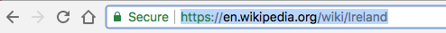

## Creando enlaces

En esta tarjeta, aprenderá cómo hacer un enlace que lo lleve a otra página al dar clic.

- Agregue el siguiente código a la sección del cuerpo de `index.html`:

```html
  <a href=""> Haga clic aquí </a>
```

Las etiquetas `<a> </a>` convierten en un enlace lo que está entre ellos.

- Intenta hacer clic en el enlace para ver qué sucede. No hace nada, ¿verdad?

Es porque el atributo `href` esta vacío por el momento. Debe contener el **URL** (dirección web) de la página a la que quiere vincularse.

- Ve a Wikipedia y busca una página sobre algo en tu sitio web. Voy a usar la página sobre Irlanda.

- Haz clic en la barra de direcciones y selecciona todo el texto en i5. Ese es el URL completo de la página en la que te encuentras. Presiona las teclas <kdb>Ctrl</kdb> ( o <kdb>cmd</kdb>) y <kdb>C</kdb> al mismo tiempo para copiarlo.
    
    

- En tu trinket, haz clic entre las comillas después de ` href = ` y presiona las teclas <kdb>Ctrl</kdb> (o <kdb>cmd</kdb>) y <kdb>V</kdb> al mismo tiempo para pegar el URL que acabas de copiar. Tu código debería verse algo así:

```html
  <a href="https://en.wikipedia.org/wiki/Ireland"> Haga clic aquí </a>
```

¡Acabas de crear tu primer enlace! Haz clic en él para ver si funciona.


## \--- collapse \---

## title: Links to other websites

Trinket has trouble with some web addresses. You can try URLs of websites other than Wikipedia if you like, but they may not work in your trinket. However, if you were to download your project and view the files in a web browser, you would see the links working.

\--- /collapse \---

- Try putting a picture in between the `<a> </a>` tags instead of the words `Click here`, like this:

```html
  <a href="https://en.wikipedia.org/wiki/Ireland">
      
  </a>
```

- Click on your picture. Do you see that it was turned into a link?

You can put a link into other elements of your webpage too, such as in a paragraph or even in a list. Here is an example of a sentence with a link in it:

```html
  <p>
    <a href="https://en.wikipedia.org/wiki/Ireland">Click here</a> to read the Wikipedia page!
  </p>
```

\--- challenge \---

## Challenge: put a link into a list

- See if you can make a list that contains a link inside one of the list items.

\--- /challenge \---