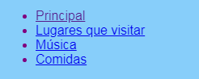

## Agregando más paginas

Esta tarjeta te mostrará como agregar mas páginas a tu sitio web.

- En parte de arriba del Panel de Código, haz click en el símbolo **+** a un lado de las pestañas, y escribe un nombre para tu nuevo archivo. Debe de terminar con `.html` (incluyendo el punto!) para que el navegador reconozca que es una página web.


## \--- collapse \---

## title: Renombrando o borrando un archivo

Si tu quieres cambiar el nombre de un archivo, da clik en el ícono **cog** a la derecha del nombre del archivo, y luego da click en ícono de **pencil**. Escribe el nuevo nombre y presiona **Enter**. Tu tambien puedes borrar un archivo solamente dando click en el ícono **bin** en lugar del ícono del **pencil**.


You might be wondering why you can't change the name of the `index.html` file. `index.html` is a special name used for the **homepage** of a website. That's the first page you land on when you visit a website. Whenever you go to a website's homepage, the browser looks for the file called `index.html` and displays it on your screen.

\--- /collapse \---

- Encuentra el archivo `blank_page.html`, copia y pega todo el código en tu nuevo archivo. Ya que quieres copiar todo, tu puedes dar click en cualquier parte del código y usar el atajo del teclado <kbd>Ctrl</kbd> (or <kbd>cmd</kbd>) y<kbd>A</kbd> para seleccionar todo de una sola vez.

- Cambia el texto entre `<title> </title>` tags para que tu nueva pagina web tenga el título adecuado. Trinket no mostrará el título, pero puedes verlo en la parte superior de la ventana de tu navegador si tu descargas el proyecto.


- Entre las `<main> </main>` etiquetas en el nuevo archivo, use las etiquetas que has aprendido para agregar elementos a la página, como párrafos, encabezados, imágenes y listas!

- Repite los pasos anteriores para cada página nueva que desees agregar.

When there are too many tabs for Trinket to show at once, you can use the **<** and **>** icons in the top left-hand corner of the tabs to scroll between them.


Now you need to make links so that you can get to each of your new pages! Let's put all the links in a list.

- En el archivo `index.html`, agrega el siguiente código al cuerpo de su página web:

```html
    <ul>
        <li><a href="index.html">Principal</a></li>
        <li><a href="attractions.html">Lugares que Visitar</a></li>
        <li><a href="music.html">Música</a></li>
        <li><a href="food.html">Comidas</a></li>
    </ul>
```

- Cambia el valor del atributo ` href ` para cada enlace (recuerda, ese es el texto entre comillas) para que coincida exactamente con el nombre de cada archivo HTML que hayas creado.

- Cambia el texto entre las etiquetas `<a> </a>` por las descripciones adecuadas de tus páginas.

Now you can navigate to your new pages!

