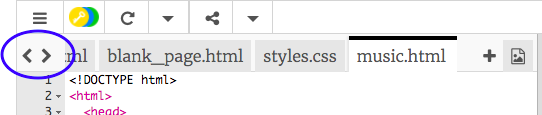

## Agregando más paginas

Esta tarjeta te mostrará como agregar mas páginas a tu sitio web.

- En parte de arriba del Panel de Código, haz click en el símbolo **+** a un lado de las pestañas, y escribe un nombre para tu nuevo archivo. Debe de terminar con `.html` (incluyendo el punto!) para que el navegador reconozca que es una página web.


## \--- collapse \---

## title: Renombrando o borrando un archivo

Si tu quieres cambiar el nombre de un archivo, da clik en el ícono **cog** a la derecha del nombre del archivo, y luego da click en ícono de **pencil**. Escribe el nuevo nombre y presiona **Enter**. Tu tambien puedes borrar un archivo solamente dando click en el ícono **bin** en lugar del ícono del **pencil**. 

Tu te podrias estar preguntando porque no puedes cambiar el nombre de archivo `index.html`. `index.html` es un nombre especial usado para la **homepage** del sitio web. That's the first page you land on when you visit a website. Whenever you go to a website's homepage, the browser looks for the file called `index.html` and displays it on your screen.

\--- /collapse \---

- Find the file `blank_page.html` and copy and paste all of the code from it into your new file. Since you want to copy the whole thing, you can click anywhere on the code and use the keyboard shortcut <kbd>Ctrl</kbd> (or <kbd>cmd</kbd>) and <kbd>A</kbd> to select all of it at once.

- Change the text in between the `<title> </title>` tags so your new page has a suitable title. Trinket won't display the title, but you can see it at the top of your browser window if you download your project.


- In between the `<main> </main>` tags in the new file, use the tags you have learned about to add stuff to the page, such as paragraphs, headings, images, and lists!

- Repeat the steps above for each new page that you want to add.

When there are too many tabs for Trinket to show at once, you can use the **<** and **>** icons in the top left-hand corner of the tabs to scroll between them.



Now you need to make links so that you can get to each of your new pages! Let's put all the links in a list.

- In the `index.html` file, add the following code to the body of your webpage:

```html
    <ul>
        <li><a href="index.html">Home</a></li>
        <li><a href="attractions.html">Places to visit</a></li>
        <li><a href="music.html">Music</a></li>
        <li><a href="food.html">Things to eat</a></li>
    </ul>
```

- Change the value of the `href` attribute for each link (remember, that's the text inside the quotation marks) so that it exactly matches the name of each HTML file that you have created.

- Change the text in between the `<a> </a>` tags to suitable descriptions of your pages.

Now you can navigate to your new pages!

