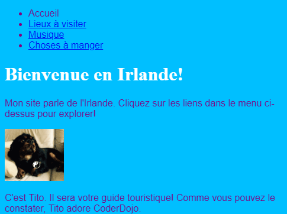
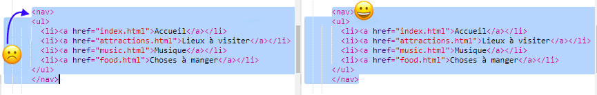

## Naviguer sur votre site

De nombreux sites ont une **navigation** menu pour aider les visiteurs à se déplacer entre les pages. Maintenant que vous avez un tas de pages, une page d'accueil et des liens vers chaque page, déplaçons la liste des liens vers une section de navigation en haut de chaque page.



- Recherchez le code de votre liste de liens que vous avez créée à l'étape précédente.

- Juste avant l'ouverture de l'étiquette `<ul>` , appuyez sur **Entrez** pour créer une nouvelle ligne vide, puis sur la nouvelle ligne, tapez l'étiquette suivante: `<nav>`. Le bijou ajoute automatiquement la balise de fermeture juste après, mais vous pouvez la supprimer - elle n'est pas au bon endroit.

- Juste **après** l'étiquette de fermeture `</ul>` , appuyez sur **Entrez** pour créer une nouvelle ligne vide, et tapez l'étiquette de fermeture `</nav>` là.

- Maintenant sélectionnez toute votre section `<nav>` et listez-la en cliquant juste avant l'ouverture `<nav>` et en faisant glisser la souris tout le long de la balise de fermeture `</nav>` , de sorte que tout le texte incluant les balises d'ouverture et de fermeture devient en surbrillance. Assurez-vous que toutes les **équerres** `<` et `>` au début et à la fin sont également mises en surbrillance!



- Vous allez **coupe** cette fois -ci au lieu de copier. Maintenez la touche <kbd>Ctrl</kbd> (ou <kbd>cmd</kbd>) enfoncée et, tout en la maintenant enfoncée, appuyez sur la touche <kbd>X</kbd>. Le code en surbrillance disparaîtra, mais ne paniquez pas!

- En haut du fichier, cliquez dans l'espace entre les balises `<header> </header>`. Assurez-vous que le curseur clignote à cet endroit. Maintenant, collez le code en appuyant sur <kbd>Ctrl</kbd> (ou <kbd>cmd</kbd>) et <kbd>V</kbd> comme d'habitude. Le code devrait ressembler à ceci:

```html
    <header>
        <nav>
            <ul>
            <li><a href="index.html">Accueil</a></li>
            <li><a href="attractions.html">Endroits à visiter</a></li>
            <li><a href="music.html">Musique</a></li>
            <li><a href="food.html">Choses à manger</a></li>
            </ul>
        </nav>
    </header>
```

## \--- effondrer \---

## titre: Annuler!

Si vous faites une erreur, vous pouvez **annuler** en appuyant sur <kbd>Ctrl</kbd> (ou <kbd>cmd</kbd>) et <kbd>Z</kbd> ensemble. Vous pouvez généralement appuyer sur cette combinaison de touches plusieurs fois pour annuler les dernières modifications. C'est un autre raccourci clavier pratique que vous pouvez utiliser dans de nombreux programmes!

\--- /effondrer \---

- Essayez vos liens pour vous assurer qu'ils fonctionnent toujours.

\--- défi \---

## Challenge: menus de navigation pour toutes les pages

- Placez cette section de code dans la section d'en-tête de chaque fichier HTML que vous avez créé. Cela fera apparaître le menu de navigation en haut de chaque page de votre site Web.
    
    \--- astuces \---
    
    \--- indice \--- Sélectionnez toute la section `<nav>` comme auparavant, et appuyez sur les touches <kbd>Ctrl</kbd> (ou <kbd>cmd</kbd>) et <kbd>C</kbd> pour les copier.

Ensuite, dans chacun de vos fichiers `.html` , cliquez à l'intérieur de la section `<header> </header>` et collez le code exactement comme vous l'avez fait précédemment. \--- / indice \---

\--- /astuces \---

Maintenant, vous serez en mesure de cliquer sur les liens, peu importe quelle page vous êtes.

\--- /défi \---