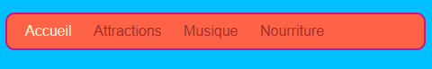
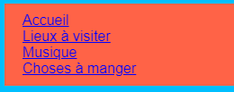
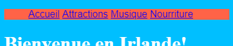
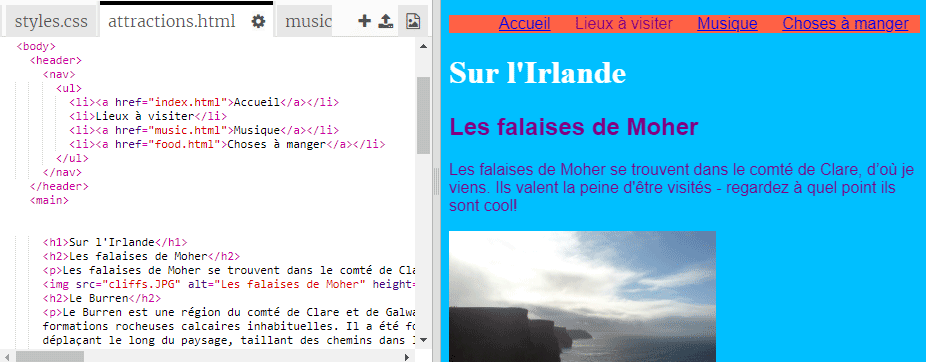

## Créer une barre de menu

Sur cette carte, tu verras comment tu peux transformer ton menu de navigation en une barre de menu à l'apparence cool, juste en ajoutant plus de règles CSS dans la feuille de style.



- Vas dans le fichier de feuille de style dans l'onglet `styles.css`. Clique **en dessous** une accolade de fermeture `}`, et appuye sur **Entrer** pour créer une nouvelle ligne vide. Ajoute la règle CSS suivante :

```css
    nav ul {
        background-color: tomato;
    }
```

Remarque comment tu as utilisé deux sélecteurs au lieu d'un ? Si tu as utilisé le sélecteur `ul` tout seul, la règle affecterait toutes les listes non ordonnées sur ton site web. En ajoutant le sélecteur `nav` le fait uniquement s'appliquer aux listes qui sont entre les balises `nav` .


Nous allons nous débarrasser des points du paragraphe. Ce sont les points devant chaque élément de la liste.

- Ajoute ce qui suit au fichier ` styles.css `. De nouveau, tape-le sur une nouvelle ligne après `}` comme ça il ne fait donc pas partie d'un autre bloc de règles.

```css
    nav ul li {
        list-style-type: none;
    }
```

Remarque cet ensemble de règles a trois sélecteurs : il sélectionne tous les éléments `li` qui sont dans une liste `ul` qui se trouve dans une section `nav` . Ouf!



Maintenant, faisons la liste horizontale (qui traverse) au lieu de la verticale (en bas).

- Dans la nouvelle règle CSS que tu viens de créer, ajoute la ligne suivante : `display: inline;`.



- Les éléments de menu sont maintenant tous regroupés, ajoutons donc aussi les propriétés `margin-right` et `margin-left` pour les espacer un peu. Le bloc de code CSS devrait maintenant ressembler à ceci:

```css
    nav ul li {
        list-style-type: none;
        display: inline;
        margin-right: 10px;
        margin-left: 10px;
    }
```

Rappelle-toi: `10px` signifie dix pixels.

Et pourquoi ne pas modifier le menu pour tu indiques la page sur laquelle tu te trouves ? Cette partie ne sera pas dans la feuille de style.

- Commence par la page d'accueil. Vas dans le fichier `index.html` . Dans la liste des liens du menu, supprime les balises de lien avant et après le mot `Accueil`, de sorte que l'élément de liste de la page d'accueil est juste du texte entre les balises `<li></li>`, comme ceci `<li>Accueil</li>`.

- Maintenant, vas dans chacun de tes autres fichiers et fais la même chose, en enlevant à chaque fois les balises de lien de la page que tu modifies. Donc, par exemple, sur le fichier `music.html` j'ai supprimé les balises de lien dans la liste `Musique`:

```html
    <header>
        <nav>
            <ul>
            <li><a href="index.html">Accueil</a></li>
            <li><a href="attractions.html">Lieux à visiter</a></li>
            <li>Musique</li>
            <li><a href="food.html">Choses à manger</a></li>
            </ul>
        </nav>
    </header>
```

- Explore tes pages en cliquant sur les liens. Vois comment la barre de menu affiche la page sur laquelle tu es en texte brut au lieu d'un lien ? 



Sur la carte suivante, tu apprendras encore plus d'astuces CSS pour rendre la barre de menu géniale.