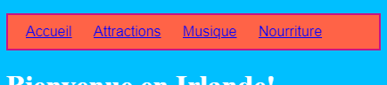
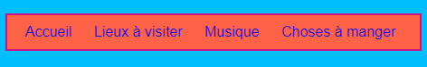
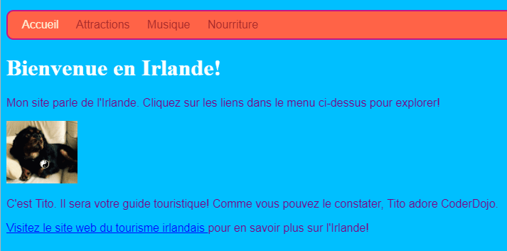

## Styliser la barre de menu

Avec CSS, les possibilités de rendre ta barre de menu belle sont infinies.

- Déplace-toi de nouveau vers le fichier `styles.css` - là où c'est vraiment intéressant!

- Trouve ton sélecteur `nav ul`, et ajoute plus de règles pour qu'il ressemble à ceci:

```css
  nav ul {
    background-color: tomato;
    border-style: solid;
    border-color: MediumVioletRed;
    border-width: 2px;
    padding: 10px;
  }
```

La propriété `padding` ajoute de l'espace. Peux-tu déterminer ce que font chacune des autres propriétés? Essaye d'expérimenter avec différentes couleurs et nombre de pixels.



- Pour se débarrasser du soulignement des liens, ajoute le code suivant sur une nouvelle ligne après l'accolade de fermeture `}` pour les règles `nav ul li`. Tu peux le mettre après `}`, mais c'est une bonne idée de garder des choses liées ensemble, ainsi c'est plus facile de trouver!

```css
  nav ul li a {
      text-decoration: none;
  }
```

La règle ci-dessus s'applique aux liens `<a>` à l'intérieur des éléments de liste `<li>` dans une liste non ordonnée `<ul>` dans une section de navigation `<nav>`. Wow, c'est quatre sélecteurs!



Rappelle-toi comment tu as supprimé les balises de lien de certains éléments de la liste dans le `<nav>` afin que tu puisses facilement voir sur quelle page tu te trouves? Pourquoi ne pas aussi modifier la couleur du texte des éléments de la liste de navigation qui ne sont pas des liens!

- Trouve ton sélecteur `nav ul li`, et **à l'intérieur** des accolades ajoute la ligne:

```css
  color: PapayaWhip;
```

Tu peux choisir une couleur que tu aimes!

Tu peux ajouter la propriété `couleur` à la règle `navul li a` si tu veux que les liens du menu aient une couleur différente des autres liens de ton site.

- Que dirais-tu de coins arrondis pour ton menu? Essaye d'ajouter le code suivant à la règle `nav ul` pour voir ce qui se passe: `border-radius: 10px;`.

La propriété `border-radius` est un moyen très facile de rendre n'importe quoi plus cool!



--- challenge ---

## Défi: faire que tes photos aient des coins arrondis

- Dans ta feuille de style, crée un nouveau jeu de règles pour les images en utilisant le sélecteur `img` et ajoute dans une règle `border-radius` à cet endroit là.

--- /challenge ---