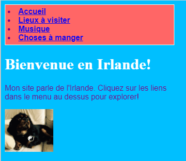
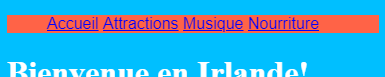
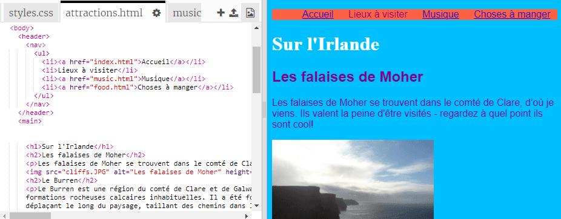

## Faire une barre de menu

Sur cette carte, vous verrez comment vous pouvez transformer votre menu de navigation en une barre de menu cool, simplement en ajoutant plus de règles CSS dans la feuille de style.


- Accédez au fichier de feuille de style dans l'onglet `styles.css`. Cliquez sur **sous** une accolade de fermeture `}`et appuyez sur **Entrez** pour créer une nouvelle ligne vide. Ajoutez la règle CSS suivante:

```css
    nav ul {background-color: tomate; }
```

Remarquez comment vous avez utilisé deux sélecteurs au lieu d'un seul? Si vous utilisiez le sélecteur `ul` seul, la règle affecterait toutes les listes non ordonnées sur votre site Web. L'ajout du sélecteur `nav` le rend également applicable uniquement aux listes situées entre `balises nav`.



Débarrassons-nous des puces. Ce sont les points devant chaque élément de la liste.

- Ajoutez ce qui suit au fichier `styles.css`. Encore une fois, tapez-le sur une nouvelle ligne après un `}` donc ce n'est pas dans un autre bloc de règles.

```css
    nav ul li {type de style de liste: aucun; }
```

Notez que cet ensemble de règles a trois sélecteurs: il sélectionne tous les éléments `li` qui se trouvent dans une liste `ul` qui se trouve dans une section `nav`. Phew!


Maintenant, faisons la liste horizontalement (à travers) au lieu de vertical (vers le bas).

- Dans la nouvelle règle CSS que vous venez de créer, ajoutez la ligne suivante: `display: inline;`.



- Les éléments du menu sont maintenant tous écrasés ensemble, alors ajoutons les propriétés `margin-right` et `margin-left` pour les espacer un peu. Le bloc de code CSS devrait ressembler à ceci maintenant:

```css
    nav ul li {type de style de liste: aucun; affichage: en ligne; marge-droite: 10px; marge gauche: 10px; }
```

Rappelez-vous: `10px` signifie dix pixels.

Que diriez-vous de changer le menu pour vous dire sur quelle page vous êtes? Cette partie ne sera pas dans la feuille de style.

- Commencez avec la page d'accueil. Allez dans le fichier `index.html`. Dans la liste des liens de menu, supprimez les balises de lien avant et après le mot `Accueil`, de sorte que l'élément de liste pour la page d'accueil soit juste entre `<li> </li>` balises, comme ceci: `<li>Accueil</li>`.

- Maintenant, allez dans chacun de vos autres fichiers et faites la même chose, en supprimant chaque fois les balises de lien de la page que vous éditez. Par exemple, sur le fichier `music.html` , j'ai supprimé les balises de lien dans l'élément de liste `Music`:

```html
    <header>
        <nav>
            <ul>
            <li><a href="index.html">Accueil</a></li>
            <li><a href="attractions.html">Endroits à visiter</a></li>
            <li>Musique</li>
            <li><a href="food.html">Choses à manger</a></li>
            </ul>
        </nav>
    </header>
```

- Explorez vos pages en cliquant sur les liens. Voyez comment la barre de menu affiche la page sur laquelle vous êtes en texte clair au lieu d'un lien? 



Sur la prochaine carte, vous apprendrez encore plus de trucs CSS pour rendre la barre de menu impressionnante.