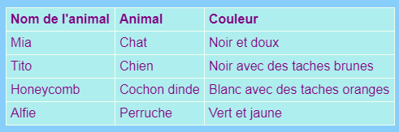

## Ajout d'un tableau

Parfois, il peut être utile de montrer des informations dans un tableau. Par exemple, tu peux t'inscrire sur un site Web pour un club de sport ou une école du coin ou pour obtenir des informations sur tes dix chansons préférées.

Un tableau est une grille composée de **lignes** et **colonnes**. La plupart des tableaux incluent également des titres en haut de chaque colonne, appelés **en-tête**. Voici un exemple:



- Allez dans le fichier `page_with_table.html`. Tu verras un tas de code entre les balises `<table> </table>`.

- Sélectionne tout le code du début de la balise `<table>` jusqu'à la fin du tag de fermeture `</table>` et copie-le. Ensuite, vas dans un de tes fichiers où tu souhaites mettre un tableau, et colle dans le code.

Pour le moment, ton tableau est vide.

- Fait un tour pour remplir ton tableau avec tout ce que tu aimes! Il suffit de mettre du texte entre les balises `<td> </td>` et entre les balises `<th> </th>` . Tu peux ajouter plus de tags si tu en as besoin.

## \--- collapse \---

## title: Exemple de code

Le code HTML pour le tableau affiché ci-dessus ressemble à ceci :

```html
  <table>
    <tr>
      <th>Nom de l'animal</th>
      <th>Animal</th>
      <th>Couleur</th>
    </tr>
    <tr>
      <td>Mia</td>
      <td>Chat</td>
      <td>Noir et doux</td>
    </tr>
    <tr>
      <td>Tito</td>
      <td>Chien</td>
      <td>Noir avec des taches brunes</td>
    </tr>
    <tr>
      <td>Honeycomb</td>
      <td>Cochon d'Inde</td>
      <td>Blanc avec des taches orange</td>
    </tr>
    <tr>
      <td>Alfie</td>
      <td>Perruche</td>
      <td>Vert et jaune</td>
    </tr>
  </table>
```

\--- /collapse \---

Pour ajouter une autre **ligne**, ajoute un autre jeu de balises `<tr> </tr>` . Entre eux, tu as mis le même nombre d'éléments de **data** avec `<td> </td>` des balises que tu as dans les autres lignes.

Pour ajouter une autre **colonne**, ajoute un élément **donnée** supplémentaire avec un ensemble de balises `<td> </td>` à **chaque** ligne. Ajoute également un élément **en-tête** supplémentaire à la première ligne, en utilisant des balises `<th> </th>` .

## \--- collapse \---

## title: Comment çà marche?

Regardons toutes ces balises. C'est un peu comme le code pour une liste (souvenez-vous `<ul>` et `<ol>`) mais avec plus de niveaux.

Chaque paire de balises `<tr> </tr>` est une ligne, donc tout entre elles sera affiché sur une ligne.

La première ligne contient des balises `<th> </th>` . Ces titres sont utilisés pour les en-têtes, donc les titres de colonne vont entre eux. Il y a une paire pour chaque colonne que vous avez dans votre table.

Les balises `<td> </td>` définissent ce que l'on appelle les données de tableau, et c'est ce qui va dans toutes les autres lignes. Ces éléments sont similaires aux tags `<li> </li>`: tout ce qui est entre eux est un élément dans votre ligne de tableau.

\--- /collapse \---

- Si tu regardes la fin du fichier `styles.css` tus verras le code CSS qui décrit comment le tableau devrait ressembler. Tu n'es pas obligé de tout comprendre! Mais tu peux essayer de changer les couleurs du texte, la bordure et l'arrière-plan pour créer ton propre style.

```css
  table, th, td {
    border: 1px solid HoneyDew;
    border-collapse: collapse;
  }
  tr {
    background-color: PaleTurquoise;
  }
  th, td {
    vertical-align: top;
    padding: 5px;
    text-align: left;
  }
  th {
    color: purple;
  }
  td {
    color: purple;
  }
```

Note que certains des sélecteurs utilisent des virgules, par exemple `table, th, td`? C'est une **liste de sélecteurs**: cela signifie qu'elle s'applique à tout les éléments `<th>` et à tous les éléments `<td>` . Il permet de taper le même jeu de règles pour chaque sélecteur !