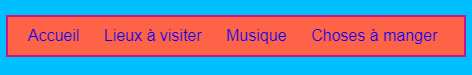
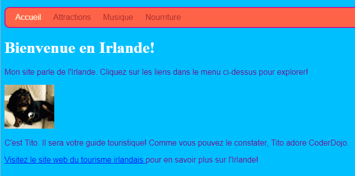

## Styliser la barre de menu

Avec le CSS, les possibilités de rendre votre barre de menu belle sont infinies.

- Déplacez-vous dans le fichier `styles.css` à nouveau - l'endroit où les trucs cool arrivent!

- Trouvez votre sélecteur `nav ul` et ajoutez d'autres règles afin qu'elles ressemblent à ceci:

```css
  nav ul {background-color: tomate; style de bordure: solide; border-color: MediumVioletRed; border-width: 2px; rembourrage: 10px; }
```

La propriété `padding` ajoute de l'espace. Pouvez-vous déterminer ce que font chacune des autres propriétés? Essayez d'expérimenter avec différentes couleurs et nombres de pixels.


- Pour se débarrasser du soulignement des liens, ajoutez le code suivant sur une nouvelle ligne après l'accolade fermante `}` pour les `nav ul li` règles. Vous pouvez le mettre après n'importe quel `}`, mais c'est une bonne idée de garder les choses liées ensemble, donc c'est plus facile à trouver!

```css
  nav ul li a {text-decoration: aucun; }
```

La règle ci-dessus s'applique aux liens `<a>` intérieur des éléments de la liste `<li>` dans une liste non ordonnée `<ul>` intérieur d'une section de navigation `<nav>`. Wow, c'est quatre sélecteurs!



Rappelez-vous comment vous avez supprimé les balises de lien de certains éléments de la liste dans le `<nav>` afin que vous puissiez facilement voir sur quelle page vous vous trouvez? Pourquoi ne pas aussi changer la couleur du texte de ces éléments de la liste de navigation qui ne sont pas des liens!

- Trouvez votre sélecteur `nav ul li` , et **intérieur** les accolades ajoutent la ligne:

```css
  couleur: PapayaWhip;
```

Vous pouvez choisir n'importe quelle couleur que vous aimez!

Vous pouvez également ajouter la propriété `color` à la règle `nav ul li a` si vous souhaitez que les liens de menu aient une couleur différente des autres liens de votre site Web.

- Que diriez-vous de quelques coins arrondis pour votre menu? Essayez d'ajouter le code suivant à la règle `nav ul` pour voir ce qui se passe: `border-radius: 10px;`.

La propriété `border-radius` est un moyen vraiment facile de rendre tout ce qui a l'air plus cool!



\--- défi \---

## Défi: faites en sorte que vos images aient des coins arrondis

- Dans votre feuille de style, créez un nouvel ensemble de règles pour les images à l'aide du sélecteur `img` et ajoutez-y une règle `border-radius`.

\--- /défi \---