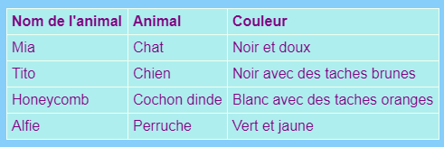

## Ajouter une table

Parfois, il peut être utile d'afficher des informations dans une table. Par exemple, vous souhaiterez peut-être répertorier les informations relatives aux membres sur un site Web pour un club de sport ou une école locale, ou des informations sur vos dix chansons favorites.

Une table est une grille composée de **lignes** et **colonnes**. La plupart des tableaux incluent également des titres en haut de chaque colonne, appelés **tête**. Voici un exemple:



- Allez dans le fichier `page_with_table.html`. Là, vous verrez un tas de code entre `<table> </table>` tags.

- Sélectionnez tout le code depuis le début de l'étiquette `<table>` jusqu'à la fin de l'étiquette de fermeture `</table>` et copiez-le. Ensuite, allez dans un de vos fichiers où vous souhaitez mettre une table, et collez le code.

En ce moment votre table est vide.

- Essayez de remplir votre table avec tout ce que vous aimez! Placez simplement le texte entre les balises `<td> </td>` et entre les balises `<th> </th>`. Vous pouvez ajouter plus de tags si vous en avez besoin.

## \--- effondrer \---

## titre: Exemple de code

Le code HTML de la table ci-dessus ressemble à ceci:

```html
  <table>
    <tr>
      <th>Nom de l'animal</th>
      <th>Animal</th>
      <th>Couleur</th>
    </tr>
    <tr>
      <td>Mia</td>
      <td>Chat</td>
      <td>Noir et pelucheux</td>
    </tr>
    <tr>
      <td>Tito</td>
      <td>Chien</td>
      <td>Noir avec des taches brunes</td>
    </tr>
    <tr>
      <td>Nid d'abeilles</td>
      <td>Cochon d'Inde</td>
      <td>Blanc avec des taches d'orange</td>
    </tr>
    <tr>
      <td>Alfie</td>
      <td>Budgie</td>
      <td>Vert et jaune</td>
    </tr>
  </table>
```

\--- /effondrer \---

Pour ajouter un autre **rangée**, ajouter un autre ensemble de `<tr> </tr>` tags. Entre eux, vous mettez le même nombre de **données** éléments avec `<td> </td>` étiquettes que vous avez dans les autres lignes.

Pour ajouter un autre **colonne**, ajouter un supplément de **données** article avec un ensemble de `<td> </td>` balises à **chaque** lignes. Également ajouter un supplément de **- tête** article à la première ligne, en utilisant `<th> </th>` tags.

## \--- effondrer \---

## title: Comment ça marche?

Jetons un coup d'oeil à tous ces tags. C'est un peu comme le code d'une liste (rappelez-vous `<ul>` et `<ol>`) mais avec plus de niveaux.

Chaque paire de balises `<tr> </tr>` est une ligne, de sorte que tout ce qui se trouve entre elles sera affiché sur une ligne.

La première rangée contient `<th> </th>` étiquettes. Ceux-ci sont utilisés pour les en-têtes, donc les titres de colonne vont entre eux. Il y a une paire pour chaque colonne que vous avez dans votre tableau.

Les balises `<td> </td>` définissent ce qu'on appelle les données de table, et c'est ce qui se passe dans toutes les autres lignes. Ceux-ci sont similaires aux balises d'élément de liste `<li> </li>`: tout ce qui se trouve entre eux est un élément de votre rangée de tableau.

\--- /effondrer \---

- Si vous regardez la fin du fichier `styles.css` , vous verrez le code CSS qui décrit comment la table devrait ressembler. Vous n'avez pas à tout comprendre! Mais vous pouvez essayer de modifier le texte, la bordure et les couleurs d'arrière-plan pour créer votre propre style.

```css
  table, th, td {frontière: 1px solide HoneyDew; border-collapse: effondrement; } tr {background-color: PaleTurquoise; } th, td {vertical-align: top; rembourrage: 5px; text-align: à gauche; } th {couleur: violet; } td {couleur: violet; }
```

Remarquez comment certains des sélecteurs utilisent des virgules, par exemple `table, th, td`? C'est une liste **de sélecteurs**: cela signifie qu'elle s'applique à tous les `<th>` éléments et tous les `<td>` éléments. Il sauve taper le même ensemble de règles pour chaque sélecteur!