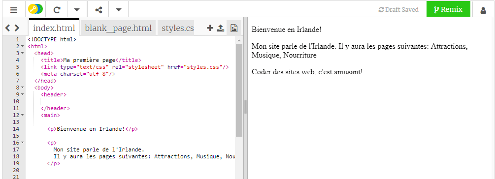

## Mise en place

- Vas vers [le trinket de démarrage](http://dojo.soy/html-b-start). Tu verras une boîte contenant un exemple de projet de site web. Le site web se trouve sur le côté droit, et le code qui crée le site web sur le côté gauche. 

## \--- collapse \---

## title: J'ai un compte Trinket

- Clique sur le bouton **Remix** en haut à droite du projet. Si tu n'es pas connecté, tu seras invité à le faire. Une fois que tu t'es connecté, tu devras cliquer à nouveau sur **Remix** . Clique sur ce bouton crée une copie du projet avec lequel tu travailles. 

Il devrait dire **remixé** après l'avoir cliqué :

\--- /collapse \---

## \--- collapse \---

## title: Je n'ai pas de compte Trinket

Tu peux enregistrer ton travail en utilisant l'une des options dans le menu **Partager** . Tu obtiendras un lien que tu peux soit enregistrer quelque part, par exemple dans un document, soit envoyer à quelqu'un par courriel. **Remarque:** à chaque fois que tu faits un changement, tu obtiendras un nouveau lien.

Si tu souhaite créer un compte sur Trinket, suit les étapes ci-dessous. Cela te permettras d'accéder facilement à ton travail depuis n'importe quel ordinateur, et aux projets **remix** que quelqu'un d'autre a partagés avec toi. Le remixage signifie que tu enregistres une copie d'un projet afin que tu puissies y apporter tes propres modifications.

- Vas sur [le site Web Trinket](http://dojo.soy/trinket) et clique **Inscrivez-vous à votre compte gratuit**. Tu auras besoin d'une adresse e-mail pour t'inscrire.

- Entre ton adresse e-mail et choisis un mot de passe, ou demande à quelqu'un de le faire pour toi.

- Tu peux maintenant accéder à tous tes projets enregistrés ou remixés en cliquant sur ton nom d'utilisateur et en allant vers **Mes Trinkets**. 

\--- /collapse \---

Commençons à coder !