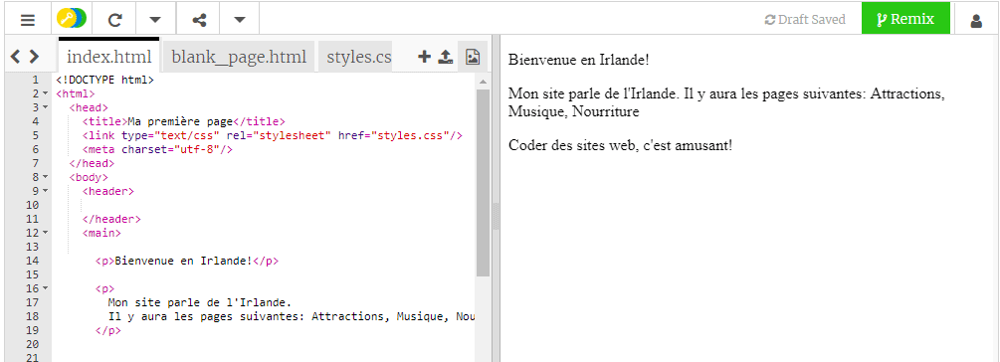

## Se mettre en place

- Aller à [le bijou de starter](http://dojo.soy/html-b-start). Vous verrez une boîte contenant un exemple de projet de site Web. Sur le côté droit est le site Web, et sur le côté gauche est le code qui rend le site Web. 

## \--- effondrer \---

## title: J'ai un compte Trinket

- Cliquez sur le bouton **Remix** en haut à droite du projet. Si vous n'êtes pas connecté, vous serez invité à le faire. Une fois que vous êtes connecté, vous devez cliquer à nouveau sur **Remix**. Cliquez sur ce bouton pour créer une copie du projet à utiliser. 

Il devrait dire **remixé** après que vous l'ayez cliqué:

\--- /effondrer \---

## \--- effondrer \---

## title: Je n'ai pas de compte Trinket

Vous pouvez enregistrer votre travail en utilisant l'une des options du menu **Partager**. Vous obtiendrez un lien que vous pouvez sauvegarder quelque part, par exemple dans un document, ou l'envoyer à quelqu'un par e-mail. **Note:** chaque fois que vous faites un changement, vous obtiendrez un nouveau lien.

Si vous souhaitez créer un compte sur Trinket, suivez les étapes ci-dessous. Cela vous permettra d'accéder à votre travail facilement à partir de n'importe quel ordinateur, et à **remix** projets que quelqu'un d'autre a partagé avec vous. Le remixage signifie que vous sauvegarderez une copie d'un projet pour que vous puissiez y apporter vos propres modifications.

- Aller à [le site Web de Trinket](http://dojo.soy/trinket) et cliquez sur **Inscrivez-vous pour votre compte gratuit**. Vous aurez besoin d'une adresse e-mail pour vous inscrire.

- Entrez votre adresse e-mail et choisissez un mot de passe, ou demandez à quelqu'un de le faire pour vous.

- Vous pouvez maintenant accéder à tous vos projets sauvegardés ou remixés en cliquant sur votre nom d'utilisateur et en allant à **Mes bibelots**. 

\--- /effondrer \---

Commençons le codage!