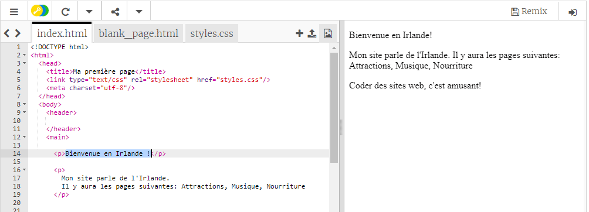
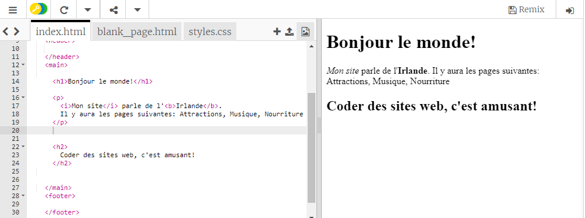

## Ta première page web !

- Dans le panneau de gauche, le **panneau de code**, clique sur l'onglet qui dit `index.html`.

- Trouve la ligne qui dit `Bienvenue en Irlande!` et change-la en y mettant ton propre message — sois prudent **ne pas** supprimer les tags`<p>` au début de la ligne et `</p>` à la fin de la ligne. Tu devras voir la mise à jour de ta page Web dans le panneau de droite.



- Maintenant sur la même ligne, change le `<p>` et `</p>` en `<h1>` et `</h1>`. As-tu remarqué un changement dans le résultat à droite?

```html
  <h1>Bienvenue en Irlande !</h1>
```

## \--- collapse \---

## title: HTML et balises expliqués

**HTML** est le code qui fait une page web.

Le `.html` dans le nom du fichier indique au navigateur que le fichier est une page web, donc le navigateur sait chercher les **balises** lui disant ce qu'il faut afficher. (Un navigateur est le programme que tu utilises pour regarder des sites Web, par exemple Chrome ou Firefox.)

Les balises HTML tel que `<p>` et `</p>` définissent des morceaux différents d'une page, par exemple des paragraphes, des rubriques ou du corps. Les morceaux sont tous appelés **éléments**. Pense-les comme des blocs de construction.

### Pourquoi ai-je besoin de deux balises ?

Tu as besoin d'une balise **d'ouverture** et d'une balise **de fermeture** pour indiquer au navigateur où les éléments **démarrent** et **finissent**. Pour un paragraphe, la balise d'ouverture `<p>` dit "Voici un texte que je veux que vous affichiez comme un paragraphe." La balise de fermeture `</p>` indique au navigateur où le paragraphe se termine.

Tout ce qui se trouve entre les balises `<body>` et ` </body>` compose ta page web.

- Remarque comment la balise de fermeture **toujours** a une barre oblique ` / ` .

\--- /collapse \---

- Essaye de changer les numéros dans tes balises **en-tête** pour voir les différentes tailles qu'ils te donnent. Ils peuvent aller de `<h1>` jusqu'à `<h6>`. N'oublie pas de changer la balise d'ouverture et de fermeture pour qu'elles correspondent.

- Trouve le code pour le paragraphe qui dit `Mon site web parle de l'Irlande.` et change-le pour qu'il ressemble à ceci :

```html
  <p>
    <em>Mon site</em> parle de l'<strong>Irlande</strong>. 
    Il y aura les pages suivantes : Attractions, Musique, Nourriture
  </p>
```

Peux-tu expliquer ce que font les balises `<em> </em>` et `<strong> </strong>`?



\--- challenge \---

## Défi: ajoute plus de texte de ton choix

- Essaye d'ajouter un nouveau paragraphe ou d'en-tête à ta page en utilisant certaines des balises que tu as apprises.

\--- hints \---

\--- hint \---

When you want to put text on a page, you need to put it in between two tags that tell your browser how to display your text. For example, the `<p> </p>` tags tell the browser that whatever is in between them is a new paragraph of text, and the `<h1> </h1>` tags tell it that the text in between is a heading.

\--- /hint \---

\--- hint \---

The code for paragraphs looks like this:

```html
  <p>Il s'agit d'un paragraphe de texte.</p>

  <p>Il s'agit d'un autre paragraphe.
  Tout ce qui se trouve entre un ensemble de balises p est 
  affiché ensemble dans une longue ligne sur la page Web. </p>
```

\--- /hint \---

\--- hint \---

The code for headings looks like this:

```html
  <h1> Ceci est une en-tête. </h1>
```

Headings will normally be displayed bigger or bolder than the paragraphs.

\--- /hint \---

\--- /hints \---

\--- /challenge \---

Congratulations, you've built your first webpage! On the next card, you'll find out how to control how it looks.