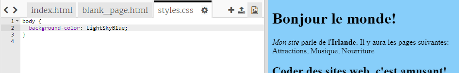
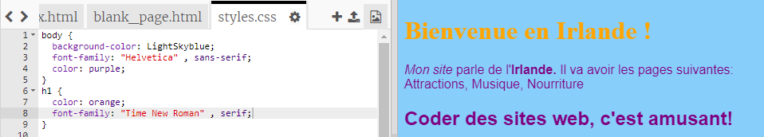

## Contrôle de l'apparence

Le code qui décrit à quoi ressemble un site Web s'appelle **CSS** .

- Regarde les onglets en haut du panneau de code, et va au fichier `styles.css` en cliquant sur l'onglet portant ce nom. Le fichier contient le texte suivant :

```css
  body {
      background-color: white;
  }
```

- Change la couleur `white` en `LightSkyBlue` et vois ce qui se passe. Ton site web devrait maintenant avoir un fond bleu! 



## \--- collapse \---

## title: Comment ça marche?

Si tu regardes le haut du fichier `index.html` tu verras la ligne suivante :

```html
  <link type="text/css" rel="stylesheet" href="styles.css"/>
```

La ligne ci-dessus indique au navigateur de rechercher un fichier spécial nommé `styles.css`. Ce fichier spécial est appelé une **feuille de style**. Tu peux reconnaître un fichier de feuille de style par `.css` dans son nom.

Une feuille de style contient des **règles** pour ce à quoi chaque élément de ta page web devrait ressembler.

Les accolades `{ }` et le code entre eux est un ensemble de ** règles CSS ** . Le mot `body` signifie que les règles sont valables pour tous les éléments `<body>` sur votre site web. Nous appelons la partie devant les crochets un **sélecteur**. Dans ce cas, c'est donc le sélecteur pour les éléments body.

Chaque règle à l'intérieur des crochets est constituée de :

- Une **propriété** à gauche, suivie d'un symbole de deux points `:`
- Une **valeur** pour la propriété sur le côté droit après les deux points
- Un symbole point-virgule `;` à la fin

\--- /collapse \---

- Ajoutons des règles pour changer l'apparence du texte. Ajouter deux nouvelles lignes dans les crochets :

```css
  body {
    background-color: LightSkyBlue;
    font-family: "Helvetica", sans-serif;
    color: purple;
  }
```

Regarde comment cela a changé la page web.

La propriété `color` est toujours pour le texte. Ici, tu définis la couleur de tous les textes dans le `corps` de ta page web.

- Tu peux également écrire des règles distinctes pour les en-têtes et les paragraphes. Pour `<h1>` les en-têtes, tu utilises le sélecteur `h1` . Sous l'accolade fermante contenant la règle CSS pour le corps, ajoute le code suivant.

```css
  h1 {
    color: orange;
    font-family: "Times New Roman", serif;
  }
```

Ton texte de titre devrait être orange maintenant, avec le paragraphe en violet comme avant.



Tu remarques que les lettres ont également un aspect différent ainsi qu'une couleur différente ? En effet, tu as changé leur **famille de polices ** . Tu peux trouver d'autres polices [ici](http://dojo.soy/web-font-families).

- Essaye d'ajouter un ensemble de règles pour les `<h2>` en-têtes en utilisant le sélecteur `h2` .

- Pourquoi ne pas expérimenter avec différentes combinaisons de couleurs pour le texte et l'arrière-plan? Il y a beaucoup de couleurs disponibles à utiliser. Trouves-en la liste complète [ ici ](http://dojo.soy/web-color-names) .