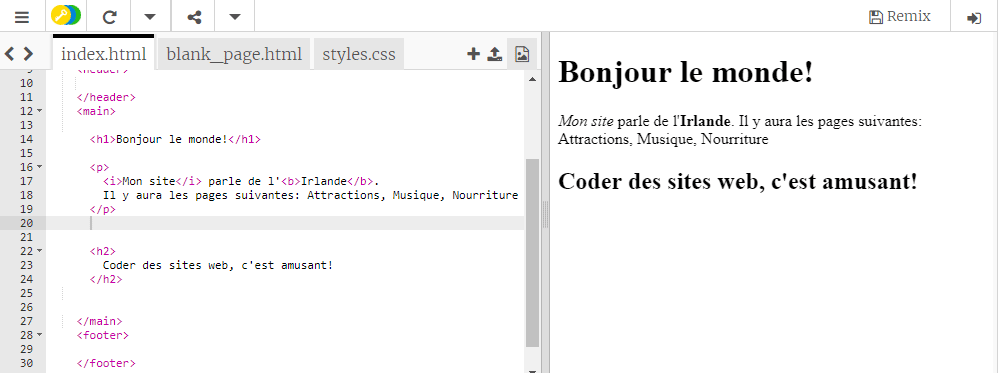

## Votre première page Web!

- Dans le panneau de gauche, le **panneau de code**, cliquez sur l'onglet qui dit `index.html`.

- Trouvez la ligne qui dit `Bienvenue en Irlande!` et changez-le en votre propre message - faites attention **pas** pour supprimer les étiquettes`<p>` au début de la ligne et `</p>` à la fin de la ligne. Vous devriez voir la mise à jour de votre page Web dans le panneau de droite.


- Maintenant, sur la même ligne, changez le `<p>` et `</p>` en `<h1>` et `</h1>`. Avez-vous remarqué un changement dans le résultat sur la droite?

```html
  <h1>Bienvenue en Irlande!</h1>
```

## \--- effondrer \---

## title: HTML et tags expliqués

**HTML** est le code qui crée une page Web.

Le `.html` dans le nom de fichier indique au navigateur que le fichier est une page Web, de sorte que le navigateur sait rechercher **étiquettes** lui indiquant ce qu'il doit afficher. (Un navigateur est le programme que vous utilisez pour consulter des sites Web, par exemple Chrome ou Firefox.)

Les balises HTML telles que `<p>` et `</p>` définissent différentes parties d'une page, par exemple des paragraphes, des en-têtes ou le corps. Les pièces sont toutes appelées **éléments**. Pensez-y comme des blocs de construction.

### Pourquoi ai-je besoin de deux tags?

Vous avez besoin d'une balise **ouverture** et **fermeture** pour indiquer au navigateur où les éléments **commencent** et **fin**. Donc, pour un paragraphe, l'étiquette `<p>` ouverture dit "Voici un texte que je veux que vous affichiez en tant que paragraphe." La balise de fermeture `</p>` indique au navigateur où se termine le paragraphe.

Tout ce qui se trouve entre les balises `<body>` et `</body>` est votre page Web.

- Remarquez comment la balise de fermeture **toujours** a une barre oblique `/`.

\--- /effondrer \---

- Essayez de changer les numéros dans vos balises **rubrique** pour voir les différentes tailles qu'ils vous donnent. Ils peuvent aller de `<h1>` jusqu'à `<h6>`. N'oubliez pas de changer les balises d'ouverture et de fermeture afin qu'elles correspondent.

- Trouvez le code pour le paragraphe qui dit `Mon site Web est sur l'Irlande.` et changez-le pour qu'il ressemble à ceci:

```html
  <p>
    <em>Mon site Web</em> est au sujet de <strong>Irlande</strong>. 
    Il va avoir les pages suivantes: Attractions, Musique, Nourriture
  </p>
```

Pouvez-vous déterminer ce que font les étiquettes `<em> </em>` et `<strong> </strong>`?



\--- défi \---

## Défi: ajouter un peu plus de texte de votre choix

- Essayez d'ajouter un nouveau paragraphe ou un nouveau titre à votre page en utilisant certains des tags que vous avez appris.

\--- astuces \---

\--- Astuce \--- Lorsque vous voulez mettre du texte sur une page, vous devez le mettre entre deux balises qui indiquent à votre navigateur comment afficher votre texte. Par exemple, les balises `<p> </p>` indiquent au navigateur que tout ce qui se trouve entre eux est un nouveau paragraphe de texte, et les balises `<h1> </h1>` indiquent que le texte entre les deux est un en-tête.

\--- / indice \---

\--- indice \---

Le code pour les paragraphes ressemble à ceci:

```html
  <p>Ceci est un paragraphe de texte.</p>

  <p>Ceci est un autre paragraphe.
  Tout ce qui se trouve entre un ensemble de points p est affiché ensemble dans une longue ligne sur la page Web.</p>
```

\--- / indice \---

\--- indice \---

Le code des en-têtes ressemble à ceci:

```html
  <h1>Ceci est un en-tête.</h1>
```

Les titres seront normalement affichés plus grands ou plus audacieux que les paragraphes.

\--- / indice \---

\--- /astuces \---

\--- /défi \---

Félicitations, vous avez construit votre première page Web! Sur la prochaine carte, vous découvrirez comment contrôler son apparence.