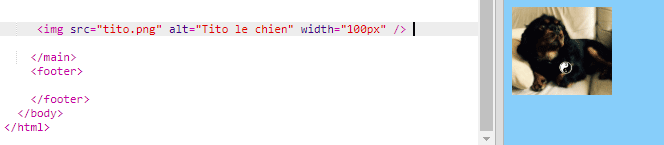

## Ajout d'images

Ajoutons une image !

- Vas sur l'onglet nommé `index.html` . Trouve la balise `</main>` et tape ce qui suit **ci-dessus** : 

```html
    
```

Voici à quoi devrait ressembler le résultat:



Note que cette balise contient des informations supplémentaires. Ils sont appelés **attributs**.

- Trouve le morceau de code qui dit `width="100px"` et essaie d'expérimenter avec des nombres différents pour voir si tu peux déterminer ce que fait cet attribut. Ne supprime pas les lettres `px`!

\--- collapse \---

* * *

## title: Comment la balise `img` fonctionne

Note que la balise `` est différente des autres comparés à ceux que avez utilisées jusqu'à présent — il n'y a pas de balise de fermeture `</img>`. Au lieu de cela, cette balise est ** à fermeture automatique ** : il a ` />` à la fin. En effet, il n'y a pas de "début" ni de "fin" dans un élément d'image, comme pour le texte sur la page.

La balise contient ** attributs ** avec des informations supplémentaires:

- L'attribut `src` indique au navigateur quel fichier utiliser pour l'image. 
- L'attribut `alt` est une courte description que le navigateur montrera s'il ne peut afficher l'image. «alt» est l'abréviation de «alternative». Ce texte aide également les personnes utilisant un lecteur d'écran à savoir quelle est l'image.
- L'attribut ` width` indique au navigateur la largeur de la photo. `100px` signifie une centaine de **pixels**, qui sont les petits points qui composent ce que tu vois sur ton écran. Si tu n'inclus pas cet attribut, l'image sera affichée dans sa taille d'origine.

\--- /collapse \---

Maintenant que tu connais le code pour mettre une image sur ton site, tu voeux probablement changer l'image, n'est-ce pas?

- La première chose dont tu auras besoin est bien sûr d'une image! Tu peux soit utiliser une que tu as déjà sur ton ordinateur, comme une photo que tu as prise, soit tu peux en obtenir une sur Internet.

[[[generic-get-picture-from-web]]]

** Note: ** toutes les images que tu trouveras sur Internet ne sont pas gratuites d'utilisation pour quiconque. Si tu télécharges une image, tu devras t'assurer que tu en as le droit. En savoir plus ici :

[[[images-permissions-to-use]]]

Une fois que tu as une photo, tu peux **télécharger** le fichier vers Trinket :

- Dans ton trinket, clique sur l'icône **image** à côté du signe **+** . 


C'est là que tu peux voir les images que tu peux utiliser sur ton site Web. Tu devrais voir l'image de Tito, le chien CoderDojo.

- Clique sur le bouton **Ajouter une image** puis clique **Télécharger**.

- Clique sur le bouton **Cliquez pour sélectionner des fichiers**. Trouve et double-clique sur ton fichier d'image dans la fenêtre qui s'ouvre.

- Clique **Terminé**.


Ton image sera téléchargée et devrait être prête à être utilisée.

- Vas dans le fichier `index.html` et trouve la balise ``. Change le texte `tito.png` pour qu'il corresponde exactement au nom du fichier image que tu as choisi. Note que son nom peut se terminer par `.jpg` au lieu de `.png` !

Le texte que tu viens de modifier est l'attribut appelé `src`, qui indique au navigateur quel fichier afficher.

**Remarque:** la valeur que tu tapes pour un attribut doit avoir des guillemets `""` autour de lui !

\--- challenge \---

## Défi : changer le texte alt de l'image

- Trouve l'attribut ` alt ` de ton élément d’image et change le texte en une brève description de ton image. 

\--- /challenge \---