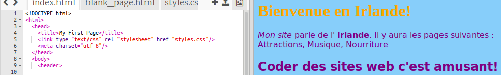

## Contrôler son apparence

Le code qui décrit à quoi ressemble un site s'appelle **CSS**.

- Regardez les onglets en haut du panneau de code, et allez dans le fichier `styles.css` en cliquant sur l'onglet avec ce nom. Le fichier contient le texte suivant:

```css
  body {background-color: blanc; }
```

- Changez le `blanc` couleur en `LightSkyBlue` et voyez ce qui se passe. Votre site web devrait maintenant avoir un fond bleu! 


## \--- effondrer \---

## title: Comment ça marche?

Si vous regardez en haut du fichier `index.html` , vous verrez la ligne suivante:

```html
  <link type="text/css" rel="stylesheet" href="styles.css"/>
```

La ligne ci-dessus indique au navigateur de rechercher un fichier spécial nommé `styles.css`. Ce fichier spécial est appelé une feuille de style ****. Vous pouvez reconnaître un fichier de feuille de style par le `.css` dans son nom.

Une feuille de style contient **règles** pour ce à quoi devrait ressembler chaque élément de votre page Web.

Les accolades `{ }` et le code entre eux sont un ensemble de **règles CSS**. Le mot `body` signifie que les règles sont pour tous les `<body>` éléments de votre site. Nous appelons le bit en face de la bouclés accolades un **sélecteur**. Donc dans ce cas, c'est le sélecteur pour les éléments du corps.

Chaque règle à l'intérieur des accolades est composée de:

- A **propriété** sur la gauche, suivi d'un symbole du côlon `:`
- A **valeur** pour la propriété sur le côté droit après le côlon
- Un symbole en forme de point-virgule `;` à la fin

\--- /effondrer \---

- Permet d'ajouter des règles pour changer l'apparence du texte. Ajoutez deux nouvelles lignes à l'intérieur des accolades:

```css
  body {background-color: LightSkyBlue; famille de polices: "Helvetica", sans-serif; couleur violet; }
```

Regardez comment cela a changé la page Web.

La propriété `color` est toujours pour le texte. Ici, vous définissez la couleur de tout le texte dans le corps `` de votre page Web.

- Vous pouvez également écrire des règles distinctes pour les titres et les paragraphes. Pour `<h1>` titres, utilisez le sélecteur `h1`. Sous l'accolade fermante contenant la règle CSS pour le corps, ajoutez le code suivant.

```css
  h1 {couleur: orange; font-family: "Times New Roman", serif; }
```

Votre texte d'en-tête devrait être orange maintenant, avec le paragraphe en violet comme avant.



Remarquez comment les lettres ont l'air différentes et sont d'une couleur différente? En effet , vous avez changé leur **famille de polices**. Vous pouvez trouver plus de polices [ici](http://dojo.soy/web-font-families).

- Essayez d'ajouter un ensemble de règles pour les en-têtes `<h2>` , en utilisant le sélecteur `h2`.

- Pourquoi ne pas essayer différentes combinaisons de couleurs pour le texte et l'arrière-plan? Il y a beaucoup de couleurs disponibles à utiliser. Trouvez-en une liste complète [ici](http://dojo.soy/web-color-names).