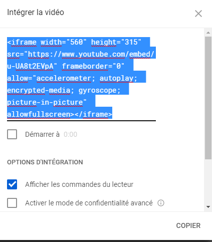
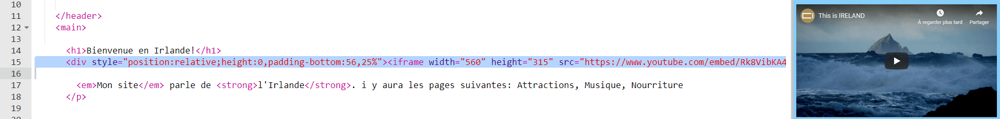

## Ajout d'une carte ou d'une vidéo

YouTube offre un moyen simple d'ajouter ses vidéos à ton site Web. L’ajout d’éléments d’autres sources en ligne à ton site Web est également appelé **intégration**.

- Recherche une vidéo sur YouTube que tu souhaites afficher sur ton site Web.

- Clique sur le bouton **Partager** en dessous de la vidéo. Sélectionne l'option **Intégrer** .

Tu verras une boîte de texte avec tout le texte sélectionné. Si tu désélectionne accidentellement le texte, tu peux le sélectionner à nouveau en cliquant dessus et en appuyant sur les touches <kbd>Ctrl</kbd> (ou <kbd>cmd</kbd> sur un Mac) et <kbd>A</kbd> en même temps.

- Appuie sur les touches <kbd>Ctrl</kbd> (ou <kbd>cmd</kbd> sur un Mac) et <kbd>C</kbd> ensemble pour copier le texte.

- Ensuite, retournez au code HTML de ton site Web, et clique sur l'endroit où tu veux mettre la vidéo, par exemple en dessous d'un titre ou d'un paragraphe. **Colle** le code en appuyant sur <kbd>Ctrl</kbd> (ou <kbd>cmd</kbd> sur un Mac) et <kbd>V</kbd> sur ton clavier en même temps. Ne t’inquiètes pas de comprendre tout le code que tu viens de coller !

Tu devrais voir la vidéo apparaître sur ta page Web.

La même technique fonctionne aussi pour les cartes Google. Fait un essai !

- Vas [ici](http://dojo.soy/google-maps) et recherche un endroit que tu veux afficher sur ton site. **Note:** ne partage pas **pas** des informations personnelles telles que ton adresse de domicile sur un site web !

- Clique sur le résultat, puis clique sur le bouton **Partager** et copie le code et ajoute-le à ton site Web comme ci-dessus. 

- Si tu regardes attentivement, tu devrais trouver les **attributs** `width` et `height` dans le code collé. Tu peux modifier leurs valeurs pour rendre la carte plus grande ou plus petite.

