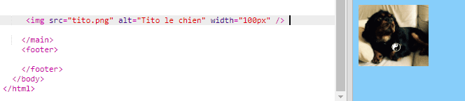

## Ajouter des images

Ajoutons une photo!

- Accédez à l'onglet nommé `index.html`. Trouvez la balise `</main>` et tapez les **suivantes ci-dessus**: 

```html
    
```

Voici à quoi devrait ressembler le résultat:



Notez que cette balise contient des informations supplémentaires. Ils sont appelés **attributs**.

- Trouvez le bit de code qui dit `width = "100px"` et essayez d'expérimenter avec des nombres différents pour voir si vous pouvez comprendre ce que fait cet attribut. Ne supprimez pas les lettres `px`!

\--- effondrer \---

* * *

## title: Comment fonctionne la balise ``

Notez que la balise `` est différente des autres balises que vous avez utilisées jusqu'à présent - il n'y a pas de balise de fermeture `</img>`. Au lieu de cela, cette balise est **à fermeture**: il a `/>` à la fin. C'est parce qu'il n'y a pas de 'start' et 'end' à un élément de l'image comme il y a du texte sur la page.

La balise contient **attributs** avec des informations supplémentaires:

- L'attribut `src` indique au navigateur quel fichier utiliser pour l'image. 
- L'attribut `alt` est une courte description que le navigateur affichera s'il ne peut pas afficher l'image. 'alt' est l'abréviation de 'alternative'. Ce texte aide également les personnes utilisant un lecteur d'écran à savoir ce qu'est l'image.
- L'attribut `width` indique au navigateur la largeur de l'image. `100px` signifie cent **pixels**, qui sont les petits points qui composent ce que vous voyez sur votre écran. Si vous n'incluez pas cet attribut, l'image sera affichée dans sa taille d'origine.

\--- /effondrer \---

Maintenant que vous connaissez le code pour mettre une image sur votre site Web, vous voulez probablement changer l'image, non?

- La première chose dont vous aurez besoin est, bien sûr, une image! Vous pouvez soit en utiliser un que vous avez déjà sur votre ordinateur, comme une photo que vous avez prise, ou vous pouvez en obtenir un sur Internet.

[[[generic-get-picture-from-web]]]

**Note:** toutes les images que vous trouverez sur internet sont gratuites pour quiconque. Si vous téléchargez une image, vous devez vous assurer que c'est une image que vous êtes autorisé à utiliser. En savoir plus à ce sujet ici:

[[[images-permissions-to-use]]]

Une fois que vous avez une photo, vous pouvez **télécharger** fichier à Trinket:

- Dans votre bijou, cliquez sur l'icône **image** côté du signe **+**. 


C'est ici que vous pouvez voir les images que vous pouvez utiliser sur votre site web. Vous devriez voir l'image de Tito, le chien CoderDojo.

- Cliquez sur le bouton **Ajouter une image** , puis sur **Télécharger**.

- Cliquez sur le bouton **Cliquez pour sélectionner les fichiers**. Recherchez et double-cliquez sur votre fichier image dans la fenêtre qui s'ouvre.

- Cliquez sur **Terminé**.


Votre photo sera téléchargée et devrait être prête à être utilisée.

- Allez dans le fichier `index.html` et trouvez la balise ``. Changez le texte `tito.png` pour qu'il corresponde exactement au nom du fichier image que vous avez choisi. Notez que son nom peut se terminer par `.jpg` au lieu de `.png`!

Le texte que vous venez de modifier est l'attribut appelé `src`, qui indique au navigateur quel fichier afficher.

**Note:** la valeur que vous tapez pour un attribut doit avoir des guillemets `""` autour de lui!

\--- défi \---

## Défi: changer le texte alt de l'image

- Trouvez l'attribut `alt` de votre élément d'image et changez le texte en une courte description de votre image. 

\--- /défi \---