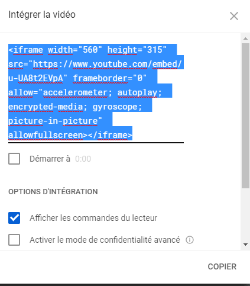
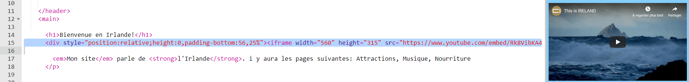
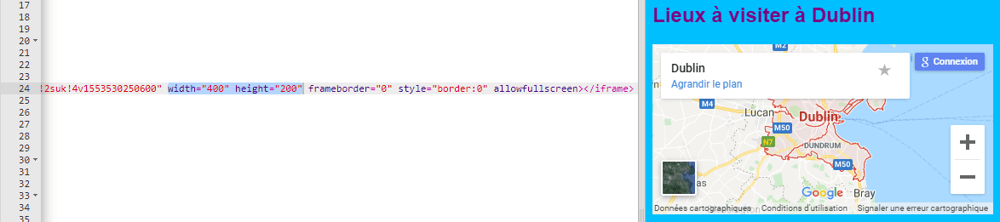

## Ajouter une carte ou une vidéo

YouTube fournit un moyen facile d'ajouter ses vidéos à votre site Web. L'ajout d'éléments provenant d'autres sources en ligne à votre site Web est également appelé **embedding**.

- Recherchez une vidéo sur YouTube que vous souhaitez afficher sur votre site Web.

- Cliquez sur le bouton **Partager** sous la vidéo. Sélectionnez l'option **Intégrer**.

Vous verrez une zone de texte avec tout le texte sélectionné. Si vous avez accidentellement désélectionné le texte, vous pouvez le sélectionner à nouveau en cliquant dessus et en appuyant sur les touches <kbd>Ctrl</kbd> (ou <kbd>cmd</kbd> sur un Mac) et <kbd>A</kbd> en même temps.

- Appuyez sur les touches <kbd>Ctrl</kbd> (ou <kbd>cmd</kbd> sur un Mac) et <kbd>C</kbd> pour copier le texte.

- Revenez ensuite au code HTML de votre site Web et cliquez à l'endroit où vous souhaitez placer la vidéo, par exemple sous un en-tête ou un paragraphe. **Collez** le code en appuyant sur <kbd>Ctrl</kbd> (ou <kbd>cmd</kbd> sur un Mac) et <kbd>V</kbd> sur votre clavier en même temps. Ne vous inquiétez pas de comprendre tout le code que vous venez de coller!

Vous devriez voir la vidéo apparaître sur votre page Web.

La même technique fonctionne également pour Google Maps. Essayez!

- Allez [ici](http://dojo.soy/google-maps) et recherchez un lieu que vous souhaitez afficher sur votre site Web. **Note:** ne **pas** partager des informations personnelles telles que l'adresse de votre domicile sur un site Web!

- Cliquez sur le résultat, puis sur le bouton **Partager** , copiez le code et ajoutez-le à votre site Web comme ci-dessus. 

- Si vous regardez attentivement, vous devriez trouver `largeur` et `hauteur` **attributs** dans le code collé. Vous pouvez modifier leurs valeurs pour que la carte apparaisse plus grande ou plus petite.

