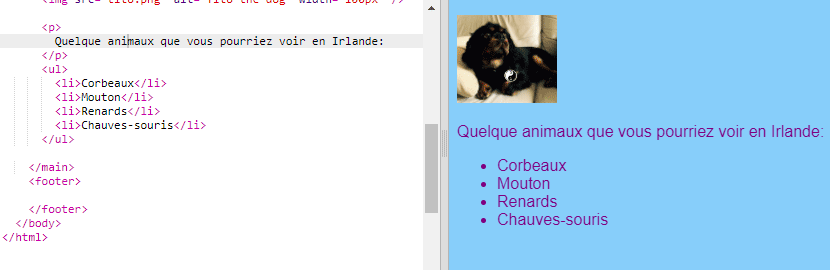
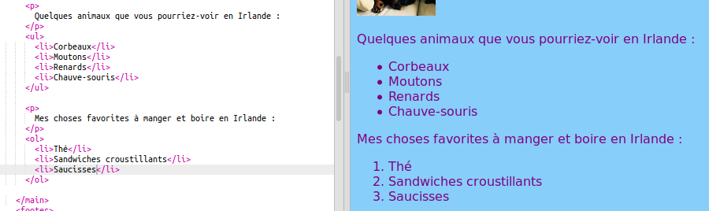

## Créer une liste

Tu vas maintenant apprendre à transformer une liste d'éléments, tels que "licornes, robots, chats", en une liste plus esthétique avec laquelle tu pourras faire des choses cool plus tard.

- Dans le fichier `index.html` ajoute le code suivant juste au-dessus de la ligne avec `</main>` dessus:

```html
    <ul>
        <li>Vaches</li>
        <li>Mouton</li>
        <li>Renards</li>
        <li>Chauves-souris </li>
    </ul>
```

Le résultat devrait être une belle liste comme celle-ci:



Note qu'il y a une paire de balises `<li> </li>` séparées autour de chaque élément dans la liste.

Il s'agit d'une liste de certains animaux que tu pourrais voir en Irlande. Tu peux modifier les éléments de la liste en éléments utiles pour ton site Web et ajoute un paragraphe au-dessus de la liste pour décrire la liste, si tu le souhaites!

Et si tu voulais une liste numérotée? C'est presque pareil, mais au lieu de `<ul>`, tu utilises `<ol>`. Une liste numérotée est également appelée une liste **ordonnée**.

- Ajoute le code suivant sous le code que tu viens d'écrire — assure-toi qu'il est **en dessous** de la balise `</ul>`!

```html
    <p>
        Mes choses préférées à manger et boire en Irlande sont:
    </p>
    <ol>
        <li>Thé</li>
        <li>Sandwiches croustillants</li>
        <li>Saucisses </li>
    </ol>
```

Voici à quoi cela devrait ressembler maintenant:



--- challenge ---

## Défi: ajouter du style à tes listes

- Vois si tu peux ajouter les **règles CSS** dans ta feuille de style pour changer l’apparence de tes listes.

--- /challenge ---