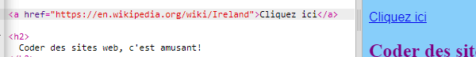

## Création de liens

Sur cette carte, tu apprendras à créer un lien qui te mènera à une autre page lorsque tu cliques dessus.

- Ajoute le code suivant à la section body de `index.html`:

```html
  <a href="">Clique ici</a>
```

Les balises `<a> </a>` transforment tout ce qui est entre elles en un lien.

- Essaye de cliquer sur ton lien pour voir ce qui se passe. Ça ne fait rien, n'est-ce pas?

C'est parce que l'attribut `href` est vide pour le moment. Il doit contenir l' **URL** (adresse web) de la page à laquelle tu souhaites lier.

- Va sur Wikipedia et trouve une page sur quelque chose sur ton site. Je vais utiliser la page sur l'Irlande.

- Clique dans la barre d'adresse et sélectionne tout le texte dans i5. C'est l'URL complète de la page sur laquelle tu te trouves. Appuie sur les touches <kdb>Ctrl</kdb> (ou <kdb>cmd</kdb>) et <kdb>C</kdb> en même temps pour le copier.
    
    

- Dans ton trinket, clique entre les guillemets après `href=` et appuie sur les touches <kdb>Ctrl</kdb> (ou <kdb>cmd</kdb>) et <kdb>V</kdb> en même temps pour coller dans l'URL ce que tu viens de copier. Ton code devrait ressembler à ceci maintenant :

```html
  <a href="https://en.wikipedia.org/wiki/Ireland">Clique ici</a>
```

Tu viens de créer ton premier lien ! Clique dessus pour voir si cela fonctionne maintenant.



## \--- collapse \---

## title: Liens vers d'autres sites web

Trinket a des problèmes avec certaines adresses web. Tu peux essayer des URL de sites web autres que Wikipédia si tu le souhaites, mais ils se peut qu'ils ne fonctionnent pas dans ton trinket. Toutefois, si tu dois télécharger ton projet et afficher les fichiers dans un navigateur Web, les liens fonctionneraient.

\--- /collapse \---

- Essaye de mettre une image entre les balises `<a> </a>` au lieu des mots `Cliquez ici`, comme ceci :

```html
  <a href="https://en.wikipedia.org/wiki/Ireland">
      
  </a>
```

- Clique sur ton image. Vois-tu que cela a été transformé en un lien?

Tu peux également mettre un lien vers d'autres éléments de ta page Web, comme dans un paragraphe ou même dans une liste. Voici un exemple de phrase avec un lien dedans :

```html
  <p>
    <a href="https://en.wikipedia.org/wiki/Ireland">Clique ici</a> pour lire la page Wikipédia!
  </p>
```

\--- challenge \---

## Défi: mettre un lien dans une liste

- Vois si tu peux créer une liste contenant un lien dans l'un des éléments de la liste.

\--- /challenge \---