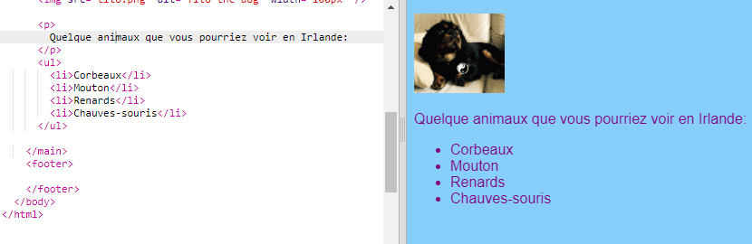

## Faire une liste

Maintenant, vous apprendrez comment transformer une liste d'éléments, tels que "licornes, robots, chats", en une liste plus belle que vous pouvez faire des choses cool avec plus tard.

- Dans le fichier `index.html` , ajoutez le code suivant juste au-dessus de la ligne avec `</main>` dessus:

```html
    <ul>
        <li>Vaches</li>
        <li>Moutons</li>
        <li>Renards</li>
        <li>Chauves-souris</li>
    </ul>
```

Le résultat devrait être une belle liste comme ceci:



Notez qu'il existe une paire distincte de balises `<li> </li>` autour de chaque élément de la liste.

Ceci est une liste de quelques animaux que vous pourriez voir en Irlande. Vous pouvez modifier les éléments de la liste en fonction de ce qui est logique pour votre site Web et ajouter un paragraphe au-dessus de la liste pour décrire la liste de ceux-ci, si vous le souhaitez!

Et si vous vouliez une liste numérotée? C'est presque pareil, mais au lieu de `<ul>`, vous utilisez `<ol>`. Une liste numérotée est également appelée une liste **ordonnée**.

- Ajoutez le code suivant ci-dessous le code que vous venez d'écrire - assurez-vous qu'il est **ci-dessous** le tag `</ul>`!

```html
    <p>
        Mes choses préférées à manger et à boire en Irlande sont:
    </p>
    <ol>
        <li>Thé</li>
        <li>Sandwichs croquants</li>
        <li>Saucisses</li>
    </ol>
```

Voici à quoi cela devrait ressembler maintenant:


\--- défi \---

## Défi: ajouter du style à vos listes

- Voyez si vous pouvez ajouter **règles CSS** à votre feuille de style pour modifier l'aspect de vos listes.

\--- /défi \---