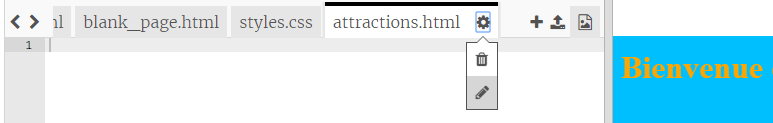
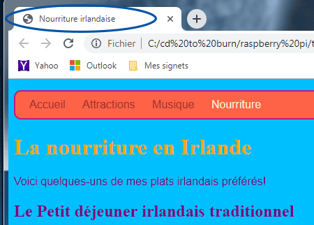
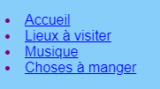

## Ajout de pages supplémentaires

Cette carte te montreras comment ajouter plus de pages à ton site web.

- En haut du panneau de code, clique sur le symbole **+** à côté des onglets, et tape un nom pour ton nouveau fichier. Il doit se terminer par `.html` (y compris le point!) afin que le navigateur sache qu'il s'agit d'une page web.


## \--- collapse \---

## title: Renommer ou supprimer un fichier

Si tu veux changer le nom d'un fichier, clique sur l'icône **rouage** à droite du nom du fichier, puis clique sur l'icône **crayon** . Tape le nouveau nom et appuie sur **Entrer**. Tu peux également supprimer un fichier en cliquant sur l'icône **poubelle** au lieu de l'icône **crayon** . 

Tu te demandes peut-être pourquoi tu ne peux pas changer le nom du fichier `index.html`. `index.html` est un nom spécial utilisé pour la **page d'accueil** d'un site web. C'est la première page sur laquelle tu te trouves lorsque tu visites un site Web. Chaque fois que tu vas sur la page d'accueil d'un site web, le navigateur recherche le fichier `index.html` et l'affiche sur ton écran.

\--- /collapse \---

- Trouve le fichier `blank_page.html` et copie et colle tout le code de celui-ci dans ton nouveau fichier. Comme tu veux copier tout le contenu, tu peux cliquer n'importe où sur le code et utiliser le raccourci clavier <kbd>Ctrl</kbd> (ou <kbd>cmd</kbd>) et <kbd>A</kbd> pour sélectionner tout en une fois.

- Change le texte entre les balises `<title> </title>` pour que ta nouvelle page ait un titre approprié. Trinket n'affichera pas le titre, mais tu peux le voir en haut de ta fenêtre de navigateur si tu télécharges ton projet.



- Entre les balises `<main> </main>` dans le nouveau fichier, utilise les balises que tu as apprises à ajouter aux pages, tels que les paragraphes, les en-têtes, les images et les listes!

- Répète les étapes ci-dessus pour chaque nouvelle page que tu souhaites ajouter.

Quand il y a trop d'onglets à afficher simultanément pour Trinket, tu peux utiliser les icônes ** < ** et <0 >> </strong> dans le coin supérieur gauche des onglets pour les faire défiler.


Tu dois maintenant créer des liens pour accéder à chacune de tes nouvelles pages! Mettons tous les liens dans une liste.

- Dans le fichier `index.html` ajoute le code suivant au corps de ta page web :

```html
    <ul>
        <li><a href="index.html">Accueil</a></li>
        <li><a href="attractions.html">Lieux à visiter</a></li>
        <li><a href="music.html">Musique</a></li>
        <li><a href="food.html">Choses à manger</a></li>
    </ul>
```

- Change la valeur de l'attribut `href` pour chaque lien (rappelle-toi, c'est le texte dans les guillemets) afin qu'il corresponde exactement au nom de chaque fichier HTML que tu as créé.

- Change le texte entre les balises `<a> </a>` pour les descriptions appropriées de vos pages.

Maintenant, tu peux naviguer vers tes nouvelles pages!

