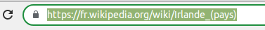
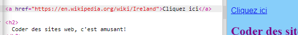

## Créer des liens

Sur cette carte, vous apprendrez à créer un lien qui vous mènera à une autre page lorsque vous aurez cliqué dessus.

- Ajoutez le code suivant à la section body de `index.html`:

```html
  <a href="">Cliquez ici</a>
```

Les balises `<a> </a>` transforment tout ce qui se trouve entre eux en un lien.

- Essayez de cliquer sur votre lien pour voir ce qui se passe. Ça ne fait rien, n'est-ce pas?

C'est parce que l'attribut `href` est vide pour le moment. Il doit contenir le **URL** (adresse Web) de la page que vous souhaitez lier.

- Aller à Wikipedia et trouver une page sur quelque chose sur votre site Web. Je vais utiliser la page sur l'Irlande.

- Cliquez dans la barre d'adresse et sélectionnez tout le texte dans i5. C'est l'URL complète de la page sur laquelle vous êtes. appuie sur le <kdb>Ctrl</kdb> (ou <kdb>cmd</kdb>) et <kdb>C</kdb> touches en même temps pour le copier.
    
    

- Dans votre bijou, cliquez entre les guillemets après `href =` et appuyez sur <kdb>Ctrl</kdb> (ou <kdb>cmd</kdb>) et <kdb>V</kdb> touches en même temps pour coller dans l'URL que vous venez de copier. Votre code devrait ressembler à ceci:

```html
  <a href="https://en.wikipedia.org/wiki/Ireland">Cliquez ici</a>
```

Vous venez de créer votre premier lien! Cliquez dessus pour voir si cela fonctionne maintenant.



## \--- effondrer \---

## title: Liens vers d'autres sites

Le bijou a des problèmes avec certaines adresses Web. Vous pouvez essayer des URL de sites Web autres que Wikipédia si vous le souhaitez, mais ils peuvent ne pas fonctionner dans votre bijou. Toutefois, si vous deviez télécharger votre projet et afficher les fichiers dans un navigateur Web, vous verriez les liens fonctionner.

\--- /effondrer \---

- Essayez de mettre une image entre les balises `<a> </a>` au lieu des mots `Cliquez ici`, comme ceci:

```html
  <a href="https://en.wikipedia.org/wiki/Ireland">
      
  </a>
```

- Cliquez sur votre photo Voyez-vous qu'il a été transformé en un lien?

Vous pouvez également insérer un lien dans d'autres éléments de votre page Web, par exemple dans un paragraphe ou même dans une liste. Voici un exemple de phrase avec un lien:

```html
  <p>
    <a href="https://en.wikipedia.org/wiki/Ireland">Cliquez ici</a> pour lire la page Wikipedia!
  </p>
```

\--- défi \---

## Défi: mettre un lien dans une liste

- Voyez si vous pouvez faire une liste qui contient un lien dans l'un des éléments de la liste.

\--- /défi \---