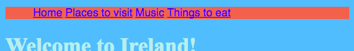

## मेन्यू बार बनाना

इस कार्ड पर आप देखेंगे कि कैसे स्टाइल शीट में कुछ और CSS नियम जोड़कर आप अपने नेविगेशन मेनू को सुंदर मेनू बार में बदल सकते हैं।


- `style.css` टैब में स्टाइल शीट फ़ाइल पर जाएँ। एक बंद घुंघराले ब्रेस `}` के **नीचे** क्लिक करें, और **enter** दबाकर एक नई रिक्त पंक्ति दर्ज करें। निम्नलिखित CSS नियम जोड़ें:

```css
    nav ul {
        background-color: tomato;
    }
```

ध्यान दें कि कैसे आपने एक के बजाय दो चयनकर्ताओं का उपयोग किया? यदि आपने `ul` चयनकर्ता का उपयोग किया है, तो अपने आप ही नियम आपकी वेबसाइट पर सभी अनियंत्रित सूचियों को प्रभावित करेगा। `nav` चयनकर्ता को जोड़ने से यह केवल उन सूचियों के रूप पर लागू होता है जो `nav` टैग के बीच में हैं।


चलो बुलेट बिंदु हटा देते हैं। वे प्रत्येक सूची वस्तु के सामने आने वाले बिन्दु हैं।

- निम्नलिखित कोड को `style.css` फ़ाइल में जोड़ें। इसे भी `}` के बाद एक नई लाइन पर टाइप करें इसलिए यह नियमों के किसी अन्य ब्लॉक के अंदर नहीं है।

```css
    nav ul li {
        list-style-type: none;
    }
```

ध्यान दें कि नियमों के इस सेट में तीन चयनकर्ता हैं: यह सभी `li` तत्व का चयन करता है जो `ul` सूची में हैं जो `nav` अनुभाग के अंदर है। उफ़!


अब चलो ऊर्ध्वाधर (नीचे) के बजाय सूची को क्षैतिज (पार) बनाते हैं।

- आपके द्वारा अभी बनाए गए नए CSS नियम के अंदर, निम्न पंक्ति जोड़ें: ` display: inline;`।



- मेनू की वस्तुएं अब सभी एक साथ भीड़ में हैं, तो चलिए उन्हें थोड़ा बाहर निकालने के लिए गुणों को भी जोड़ते हैं `margin-right` और `margin-left`। CSS कोड का ब्लॉक अब इस तरह दिखना चाहिए:

```css
    nav ul li {
        list-style-type: none;
        display: inline;
        margin-right: 10px;
        margin-left: 10px;
    }
```

याद रखें: `10px` का मतलब दस पिक्सेल है।

चलो ऐसा करें की मेनू बदले ताकि आपको यह पता चले की आप किस पृष्ठ पर हैं| यह भाग स्टाइल शीट में नहीं होगा।

- मुखपृष्ठ से शुरू करें। `index.html` फ़ाइल पर जाएं। मेनू लिंक की सूची में, `Home` शब्द से पहले और बाद के लिंक टैग को हटा दें ताकि मुखपृष्ठ के लिए सूची वस्तु केवल `<li> </li>` टैग के बीच का पाठ हो, इस तरह: `<li>Home</li>`।

- अब अपनी प्रत्येक अन्य फ़ाइल पर जाएं, और वही काम करें जो आपने अभी किया- हर बार आपके द्वारा संपादित किए जा रहे पृष्ठ के लिंक टैग को हटा दें। तो, उदाहरण के लिए, ` music.html` फ़ाइल में, मैंने सूचीबद्ध में से `Music` लिंक टैग हटा दिए हैं:

```html
    <header>
        <nav>
            <ul>
            <li><a href="index.html">Home</a></li>
            <li><a href="attractions.html">Places to visit</a></li>
            <li>Music</li>
            <li><a href="food.html">Things to eat</a></li>
            </ul>
        </nav>
    </header>
```

- लिंक पर क्लिक करके अपने पृष्ठों का अन्वेषण करें। देखें कि मेनू बार उस पृष्ठ को कैसे लिंक के बजाय सादे पाठ के रूप में दिखाता है जिस पर आप हैं? 


अगले कार्ड पर आप मेन्यू बार को और भी बढ़िया दिखाने के लिए CSS युक्तियाँ सीखेंगे।