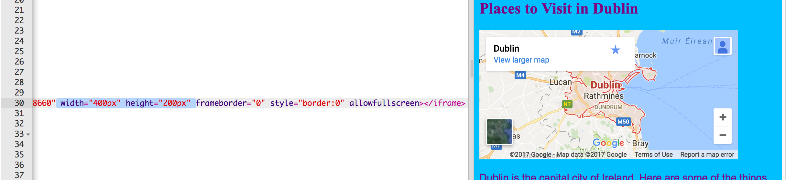

## नक्शा या वीडियो जोड़ना

YouTube अपनी वीडियो को अपनी वेबसाइट पर जोड़ने का एक आसान तरीका देता है। अपनी वेबसाइट पर अन्य ऑनलाइन स्रोतों से तत्वों को जोड़ना ** एम्बेडिंग ** भी कहलाता है ।

- YouTube पर एक वीडियो ढूंढें जिसे आप अपनी वेबसाइट पर दिखाना चाहते हैं।

- वीडियो के नीचे **Share** बटन पर क्लिक करें। **Embed** विकल्प का चयन करें।

आपको एक टेक्स्ट बॉक्स दिखाई देगा जिसमें सभी टेक्स्ट चयनित है। यदि आप गलती से टेक्स्ट को चयन रद्द करते हैं, तो आप उस पर क्लिक करके और<kbd> Ctrl </kbd> (या <kbd> cmd </kbd> एक मैक पर) और <kbd> A </kbd> एक ही समय पर दबाकर सभी टेक्स्ट को फिर से चुन सकते हैं।

- पाठ की प्रतिलिपि बनाने के लिए <kbd> Ctrl</kbd> (या <kbd> cmd </kbd> एक मैक पर) और <kbd> C</kbd> कुंजियाँ एक साथ दबाएं।

- फिर अपनी वेबसाइट के HTML कोड पर वापस जाएं, और उस स्थान पर क्लिक करें जहां आप वीडियो डालना चाहते हैं, उदाहरण के लिए एक शीर्षक या अनुच्छेद के नीचे। <kbd> Ctrl </kbd> (या <kbd>cmd</kbd> एक मैक पर) और <kbd>V</kbd> कीबोर्ड पर साथ में दबाकर कोड की प्रतिलिपि को ** पेस्ट करें**। आपके द्वारा अभी-अभी पेस्ट किए गए सभी कोड को समझने की चिंता न करें!

आपको अपने वेबपेज पर वीडियो दिखाई देना चाहिए।

गूगल मैप्स के लिए भी यही तकनीक काम करती है। इसे आजमा कर देखें!

- [ यहां जाएं ](http://dojo.soy/google-maps) और उस स्थान की खोज करें जिसे आप अपनी वेबसाइट पर दिखाना चाहते हैं। ** ध्यान दें:** एक वेबसाइट पर अपने घर का पता जैसे व्यक्तिगत जानकारी ** नहीं** शेयर करें!

- परिणाम पर क्लिक करें, फिर **Share** बटन पर क्लिक करें, कोड की प्रतिलिपि बना कर इसे ऊपर की तरह अपनी वेबसाइट पर जोड़ें। 

- यदि आप ध्यान से देखें, तो आपको `width` और ` height` **एट्रीब्यूट्स** पेस्ट किए गए कोड में मिलनी चाहिए। मानचित्र को बड़ा या छोटा दिखाने के लिए आप उनके मान बदल सकते हैं।

