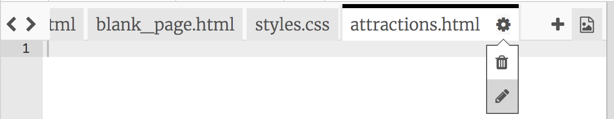
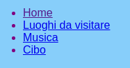

## Aggiungere più pagine

Questa scheda ti mostrerà come aggiungere più pagine al tuo sito web.

- Nella parte superiore del pannello del codice, fai clic sul simbolo **+** accanto alle schede e digita un nome per il tuo nuovo file. Deve terminare in `.html` (incluso il punto!) In modo che il browser sappia che si tratta di una pagina web.


## \--- chiudi \---

## titolo: ridenominazione o eliminazione di un file

Se si desidera modificare il nome di un file, fare clic sull'icona **cog** a destra del nome del file, quindi fare clic sull'icona **matita**. Digitare il nuovo nome e premere **Inserire**. Puoi anche eliminare un file facendo clic sull'icona **bin** invece che sull'icona **pencil**. 

Ci si potrebbe chiedere perché non è possibile modificare il nome del file `index.html`. `index.html` è un nome speciale utilizzato per la **homepage** di un sito Web. Questa è la prima pagina sulla quale ti trovi quando visiti un sito web. Ogni volta che si accede alla home page di un sito Web, il browser cerca il file denominato `index.html` e lo visualizza sullo schermo.

\--- / chiudi \---

- Trova il file `blank_page.html` e copia e incolla tutto il codice da esso nel nuovo file. Poiché vuoi copiare tutto, puoi fare clic in qualsiasi punto del codice e utilizzare la scorciatoia da tastiera <kbd>Ctrl</kbd> (o <kbd>cmd</kbd>) e <kbd>A</kbd> per selezionarla tutto in una volta.

- Cambia il testo tra i tag `<title> </title>` modo che la tua nuova pagina abbia un titolo adatto. Trinket non visualizzerà il titolo, ma puoi vederlo nella parte superiore della finestra del browser se scarichi il tuo progetto.


- Tra i tag `<main> </main>` nel nuovo file, usa i tag che hai appreso per aggiungere elementi alla pagina, come paragrafi, intestazioni, immagini ed elenchi!

- Ripeti i passaggi precedenti per ogni nuova pagina che vuoi aggiungere.

Quando ci sono troppe schede per il Trinket da mostrare contemporaneamente, puoi usare le icone **<** e **>** nell'angolo in alto a sinistra delle schede per scorrere tra di esse.


Ora devi creare collegamenti in modo da poter accedere a ciascuna delle tue nuove pagine! Mettiamo tutti i link in una lista.

- Nel file `index.html` , aggiungi il seguente codice al corpo della tua pagina web:

```html
    <ul>
        <li><a href="index.html">Home</a></li>
        <li><a href="attractions.html">Luoghi da visitare</a></li>
        <li><a href="music.html">Musica</a></li>
        <li><a href="food.html">Cose da mangiare</a></li>
    </ul>
```

- Cambia il valore dell'attributo `href` per ogni link (ricorda, questo è il testo tra virgolette) in modo che corrisponda esattamente al nome di ogni file HTML che hai creato.

- Cambia il testo tra i tag `<a> </a>` e le descrizioni appropriate delle tue pagine.

Ora puoi navigare verso le tue nuove pagine!

