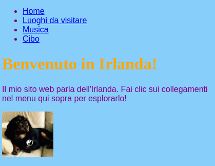
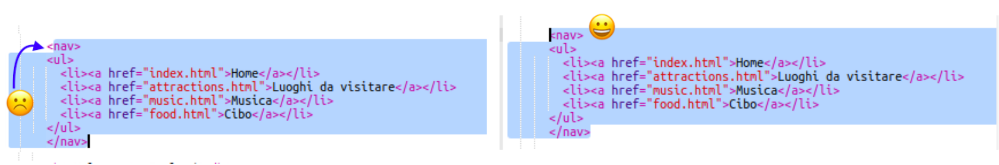

## Navigare nel tuo sito web

Molti siti web hanno un **navigazione** menu per aiutare i visitatori a spostarsi tra le pagine. Ora che hai un sacco di pagine, una home page e link a ciascuna pagina, spostiamo l'elenco dei link in una sezione di navigazione nella parte superiore di ogni pagina.



- Trova il codice per il tuo elenco di link che hai creato nel passaggio precedente.

- Poco prima del tag di apertura `<ul>` , premere **Immettere** per creare una nuova riga vuota, quindi sulla nuova riga digitare il seguente tag: `<nav>`. Il gingillo aggiunge automaticamente il tag di chiusura subito dopo, ma puoi eliminarlo: non è nel posto giusto.

- Solo **dopo** il tag di chiusura `</ul>` , premi **Inserisci** per creare una nuova riga vuota e digita il tag di chiusura `</nav>` lì.

- Ora seleziona la tua intera sezione `<nav>` ed elenca facendo clic prima del tag di apertura `<nav>` e trascinando il mouse fino a dopo il tag di chiusura `</nav>` , in modo che tutto il testo includa i tag di apertura e di chiusura diventa evidenziato. Assicurati che anche tutte le parentesi angolari **** `<` e `>` all'inizio e alla fine siano evidenziate!



- Questa volta stai andando a tagliare **** invece di copiare. Tenere premuto il tasto <kbd>Ctrl</kbd> (o <kbd>cmd</kbd>) e mentre lo si tiene premuto, premere il tasto <kbd>X</kbd>. Il codice evidenziato scompare, ma non fatevi prendere dal panico!

- Nella parte superiore del file, fai clic nello spazio tra i tag `<header> </header>`. Assicurati di vedere il cursore lampeggiare lì. Ora incolla il codice premendo <kbd>Ctrl</kbd> (o <kbd>cmd</kbd>) e <kbd>V</kbd> come al solito. Il codice dovrebbe apparire in questo modo:

```html
    <header>
        <nav>
            <ul>
            <li><a href="index.html">Home</a></li>
            <li><a href="attractions.html">Luoghi da visitare</a></li>
            <li><a href="music.html">Musica</a></li>
            <li><a href="food.html">Cose da mangiare</a></li>
            </ul>
        </nav>
    </header>
```

## \--- chiudi \---

## titolo: Annulla!

Se si commette un errore, è possibile **annullare** premendo <kbd>Ctrl</kbd> (o <kbd>cmd</kbd>) e <kbd>Z</kbd> insieme. Di solito è possibile premere questa combinazione di tasti alcune volte per annullare le ultime modifiche. Questa è un'altra pratica scorciatoia da tastiera che puoi usare in molti programmi!

\--- / chiudi \---

- Prova i tuoi link per assicurarti che funzionino ancora.

\--- sfida \---

## Sfida: menu di navigazione per tutte le pagine

- Metti questa sezione di codice nella sezione di intestazione di ogni file HTML che hai creato. Questo farà apparire il menu di navigazione nella parte superiore di ogni pagina del tuo sito web.
    
    \--- suggerimenti \---
    
    \--- suggerimento \--- Seleziona l'intera sezione `<nav>` come hai fatto prima e premi i tasti <kbd>Ctrl</kbd> (o <kbd>cmd</kbd>) e <kbd>C</kbd> insieme per copiarlo.

Quindi, in ognuno dei file `.html` , fai clic all'interno della sezione `<header> </header>` e incolla il codice esattamente come fatto in precedenza. \--- / suggerimento \---

\--- / suggerimenti \---

Ora sarai in grado di fare clic sui collegamenti indipendentemente dalla pagina in cui ti trovi.

\--- / challenge \---