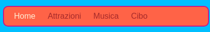

## Creare una barra dei menu

Su questa scheda vedrai come trasformare il tuo menu di navigazione in una bella barra dei menu, semplicemente aggiungendo più regole CSS nel foglio di stile.



- Vai al file del foglio di stile nella scheda `styles.css`. Fare clic su **sotto** una parentesi graffa di chiusura `}`e premere **Immettere** per creare una nuova riga vuota. Aggiungi la seguente regola CSS:

```css
    nav ul {background-color: pomodoro; }
```

Nota come hai usato due selettori invece di uno? Se hai usato il selettore `ul` da solo, la regola interesserebbe tutte le liste non ordinate sul tuo sito web. L'aggiunta del selettore `nav` lo rende applicabile solo agli elenchi che si trovano tra `tag nav`.


Liberiamoci dai punti elenco. Questi sono i punti davanti a ciascuna voce dell'elenco.

- Aggiungi quanto segue al file `styles.css`. Di nuovo, digitalo su una nuova riga dopo `}` modo che non sia all'interno di nessun altro blocco di regole.

```css
    nav ul li {list-style-type: none; }
```

Si noti che questo insieme di regole ha tre selettori: seleziona tutti gli elementi `li` che si trovano in una lista `ul` che si trova all'interno di una sezione `nav`. Accidenti!


Ora facciamo la lista orizzontale (trasversale) invece che verticale (in basso).

- All'interno della nuova regola CSS appena creata, aggiungi la seguente riga: `display: inline;`.


- Le voci del menu sono ora tutte schiacciate insieme, quindi aggiungiamo anche le proprietà `margin-right` e `margin-left` per distanziarle un po '. Il blocco del codice CSS dovrebbe apparire come questo ora:

```css
    nav ul li {list-style-type: none; display: inline; margin-right: 10px; margin-left: 10px; }
```

Ricorda: `10px` significa dieci pixel.

Che ne dici di cambiare il menu per dirti in quale pagina ti trovi? Questa parte non sarà nel foglio di stile.

- Inizia con la homepage. Vai al file `index.html`. Nell'elenco dei collegamenti del menu, rimuovi i tag di collegamento prima e dopo la parola `Home`, in modo che l'elemento di elenco per la home page sia solo testo tra `<li> </li>` tag, come questo: `<li>Home</li>`.

- Ora vai su ognuno dei tuoi altri file e fai la stessa cosa, rimuovendo ogni volta i tag di collegamento per la pagina che stai modificando. Quindi, ad esempio, nel file `music.html` , ho rimosso i tag di collegamento nella voce di elenco `Music`:

```html
    <header>
        <nav>
            <ul>
            <li><a href="index.html">Home</a></li>
            <li><a href="attractions.html">Luoghi da visitare</a></li>
            <li>Musica</li>
            <li><a href="food.html">Cose da mangiare</a></li>
            </ul>
        </nav>
    </header>
```

- Esplora le tue pagine cliccando sui link. Guarda come la barra dei menu mostra la pagina che stai usando come testo normale anziché come link? 


Nella prossima carta imparerai ancora più trucchi CSS per rendere la barra dei menu meravigliosa.