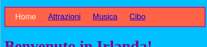
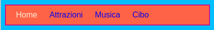
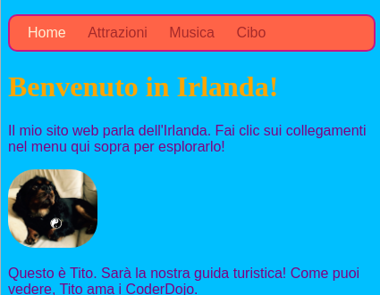

## Disegnare la barra dei menu

Con i CSS, le possibilità di rendere la tua barra dei menu meravigliosa sono infinite.

- Passa nuovamente al file `styles.css`, il luogo in cui sono contenute le scelte interessanti!

- Trova il tuo selettore `nav ul` e aggiungi altre regole in modo che assomigli a questo:

```css
  nav ul {background-color: pomodoro; border-style: solido; border-color: MediumVioletRed; larghezza del bordo: 2px; imbottitura: 10px; }
```

La proprietà `padding` aggiunge spazio. Riesci a capire cosa fanno le altre proprietà? Prova a sperimentare con colori e numeri di pixel diversi.



- Per eliminare la sottolineatura dei collegamenti, aggiungi il seguente codice su una nuova riga dopo la parentesi graffa di chiusura `}` per le `regole di nav ul li`. Puoi metterlo dopo qualsiasi `}`, ma è una buona idea tenere insieme le cose correlate in modo che sia più facile da trovare!

```css
  nav ul li a {text-decoration: none; }
```

La regola precedente si applica ai collegamenti `<a>` all'interno delle voci di elenco `<li>` in una lista non ordinata `<ul>` all'interno di una sezione di navigazione `<nav>`. Wow, sono quattro selettori!



Ricorda in che modo hai rimosso i tag link da alcuni elementi dell'elenco in `<nav>` modo da poter vedere facilmente la pagina in cui ti trovi? Perché non cambiare anche il colore del testo di quegli elementi della lista di navigazione che non sono link!

- Trova il tuo selettore `ul ul li` e **all'interno** le parentesi graffe aggiungi la linea:

```css
  colore: PapayaWhip;
```

Puoi scegliere qualsiasi colore ti piaccia!

Puoi aggiungere la proprietà `color` alla regola `nav ul li a` anche se desideri che i link dei menu siano di un colore diverso da altri link sul tuo sito web.

- Che ne dici di alcuni angoli arrotondati per il tuo menu? Prova ad aggiungere il seguente codice alla regola `nav ul` per vedere cosa succede: `border-radius: 10px;`.

La proprietà `border-radius` è un modo davvero semplice per rendere tutto più bello!



\--- challenge \---

## Sfida: crea le tue immagini con gli angoli arrotondati

- Nel tuo foglio di stile, crea un nuovo set di regole per le immagini usando il selettore `img` e aggiungi una regola di `border-radius`.

\--- /challenge \---