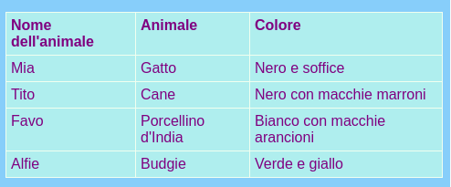

## Aggiungere una tabella

A volte può essere utile mostrare le informazioni in una tabella. Ad esempio, potresti voler elencare le informazioni sui membri su un sito web per un club sportivo locale o una scuola, o informazioni sulle tue prime dieci canzoni preferite.

Una tabella è una griglia composta da **righe** e **colonne**. La maggior parte delle tabelle include anche titoli nella parte superiore di ciascuna colonna, denominata **header**. Ecco un esempio:



- Vai al file `page_with_table.html`. Lì vedrai un mucchio di codice tra i tag `<table> </table>`.

- Seleziona tutto il codice dall'inizio del tag `<table>` fino alla fine del tag `</table>` chiusura e copialo. Quindi vai a uno dei tuoi file in cui desideri inserire una tabella e incolla il codice.

Al momento il tuo tavolo è vuoto.

- Prova a riempire il tuo tavolo con qualsiasi cosa tu voglia! Inserisci semplicemente il testo tra i tag `<td> </td>` e tra i tag `<th> </th>`. Puoi aggiungere altri tag se ne hai bisogno.

## \--- chiudi \---

## titolo: codice di esempio

Il codice HTML per la tabella mostrata sopra è simile a questo:

```html
  <table>
    <tr>
      <th>Nome dell'animale</th>
      <th>Animale</th>
      <th>Colore</th>
    </tr>
    <tr>
      <td>Mia</td>
      <td>Gatto</td>
      <td>Nero e soffice</td>
    </tr>
    <tr>
      <td>Tito</td>
      <td>Cane</td>
      <td>Nero con macchie marroni</td>
    </tr>
    <tr>
      <td>Favo</td>
      <td>Porcellino d'India</td>
      <td>Bianco con macchie arancioni</td>
    </tr>
    <tr>
      <td>Alfie</td>
      <td>Budgie</td>
      <td>Verde e giallo</td>
    </tr>
  </table>
```

\--- / chiudi \---

Per aggiungere un altro **fila**, aggiungere un altro insieme di `<tr> </tr>` tag. Tra di loro, hai messo lo stesso numero di **dati** articoli con `<td> </td>` tag come nelle altre righe.

Per aggiungere un altro **colonna**, aggiungere un ulteriore **dati** articolo con un set di `<td> </td>` tag a **ogni** righe. Anche aggiungere un ulteriore **intestazione** articolo alla prima fila, usando `<th> </th>` tag.

## \--- chiudi \---

## titolo: come funziona?

Diamo un'occhiata a tutti quei tag. È un po 'come il codice di una lista (ricorda `<ul>` e `<ol>`) ma con più livelli.

Ogni coppia di tag `<tr> </tr>` è una riga, quindi tutto tra di loro sarà visualizzato su una riga.

La prima riga contiene `<th> </th>` tag. Questi sono usati per le intestazioni, quindi i titoli delle colonne vanno tra di loro. C'è una coppia per ogni colonna che hai nella tua tabella.

I tag `<td> </td>` definiscono i cosiddetti dati della tabella, e questo è ciò che accade in tutte le altre righe. Questi sono simili ai tag item dell'elenco `<li> </li>`: tutto tra di loro è un elemento nella riga della tabella.

\--- / chiudi \---

- Se guardi alla fine del file `styles.css` , vedrai il codice CSS che descrive come dovrebbe apparire la tabella. Non devi capirlo tutto! Ma puoi sperimentare cambiando il testo, i bordi e i colori dello sfondo per progettare il tuo stile.

```css
  table, th, td {border: 1px solid HoneyDew; border-collapse: collapse; } tr {background-color: PaleTurquoise; } th, td {vertical-align: top; imbottitura: 5px; allineamento del testo: a sinistra; } th {colore: viola; } td {color: purple; }
```

Nota come alcuni dei selettori usano le virgole, ad esempio `table, th, td`? Questa è una lista **di selettori**: significa che si applica a tutti gli elementi `<th>` e tutti gli elementi `<td>`. Si risparmia digitando lo stesso insieme di regole per ciascun selettore!