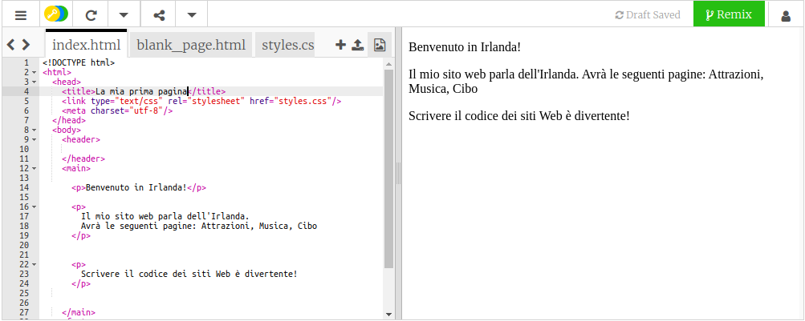

## Prepararsi

- Vai al [trinket di partenza](https://trinket.io/html/26de202a02). Sarà visualizzata una casella contenente un esempio di progetto di sito Web. Sul lato destro c'è il sito web e sul lato sinistro c'è il codice che implementa il sito. 

--- collapse ---
---
title: Ho un account Trinket
---

- Fai clic sul pulsante **Remix** nell'angolo in alto a destra del progetto. Se non hai effettuato l'accesso, ti sarà richiesto di farlo. Dopo aver effettuato l'accesso, dovrai fare nuovamente clic su **Remix**. Facendo clic su questo pulsante si crea una copia del progetto con cui lavorare. 

Dovrebbe apparire **remixed** dopo aver fatto clic su questo pulsante:

--- /collapse ---

--- collapse ---
---
title: Non ho un account Trinket
---

Puoi salvare il tuo lavoro usando una delle opzioni del menu **Share**. Otterrai un link che puoi salvare da qualche parte, ad esempio in un documento, o inviare a qualcuno via email. **Nota:** ogni volta che apporti una modifica riceverai un nuovo link.

Se vuoi creare un account su Trinket, procedi nel seguente modo. Questo vi permetterà di accedere, con facilità da qualsiasi computer, al tuo lavoro e a progetti **remixati** che qualcuno ha condiviso con te. Remixare significa salvare una copia di un progetto in modo da poter apportare modifiche ad esso.

- Vai a [il sito web di Trinket](http://dojo.soy/trinket) e fai clic su **Registrati per il tuo account gratuito**. Avrai bisogno di un indirizzo email per iscriverti.

- Inserisci il tuo indirizzo email e scegli una password, o chiedi a qualcuno di farlo per te.

- Ora puoi accedere a tutti i progetti salvati o remixati facendo clic sul tuo nome utente e andando su **My Trinkets**. 

--- /collapse ---

Iniziamo la scrittura del codice!