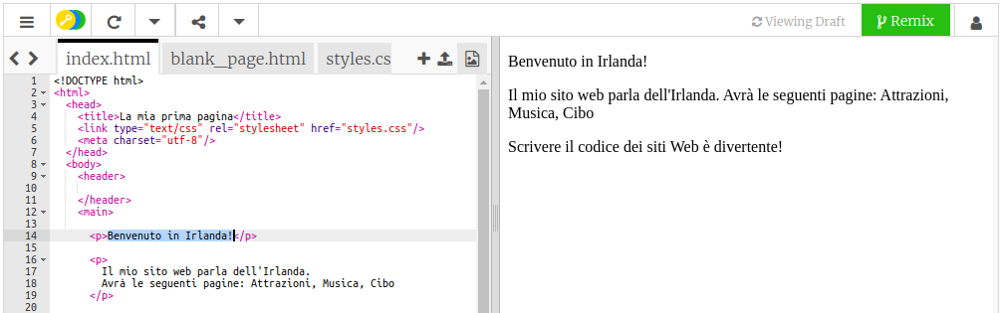
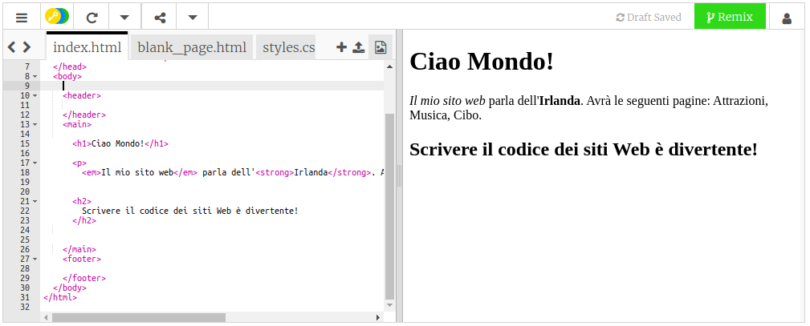

## La tua prima pagina web!

- Nel riquadro di sinistra, il **pannello del codice**, fai clic sulla scheda che dice `index.html`.

- Trova la riga che dice `Benvenuto in Irlanda!` e modificalo sul tuo messaggio - fai attenzione **a non** eliminare i tag `<p>` all'inizio della riga e `</p>` alla fine della riga. Dovresti vedere l'aggiornamento della tua pagina web nel pannello di destra.



- Ora sulla stessa linea, cambia lo `<p>` e il `</p>` a `<h1>` e `</h1>`. Noti qualche cambiamento nel risultato a destra?

```html
  <h1>Benvenuto in Irlanda!</h1>
```

--- collapse ---
---
title: HTML e tag spiegati
---

**HTML** è il codice che crea una pagina web.

Lo `.html` nel nome del file indica al browser che il file è una pagina Web, quindi il browser sa di cercare **tag** dicendogli cosa visualizzarlo. (Un browser è il programma che si usa per guardare i siti web, ad esempio Chrome o Firefox.)

Tag HTML come `<p>` e `</p>` definiscono pezzi diversi di una pagina, ad esempio paragrafi, intestazioni o il corpo. I pezzi sono tutti chiamati **elementi**. Pensa a loro come elementi costitutivi.

### Perché ho bisogno di due tag?

È necessario un tag **apertura** e **chiusura** per indicare al browser dove gli elementi **iniziano** e **terminano**. Quindi per un paragrafo, il tag di apertura `<p>` dice "Arriva un testo che voglio che tu mostri come un paragrafo". Il tag di chiusura `</p>` indica al browser dove finisce il paragrafo.

Tutto tra i tag `<body>` e `</body>` è la tua pagina web.

- Si noti come il tag di chiusura **sempre** ha una barra `/`.

--- /collapse ---

- Prova a cambiare i numeri nei tuoi tag **intestazione** per vedere le diverse dimensioni che ti danno. Possono andare da `<h1>` fino a `<h6>`. Ricorda di modificare sia il tag di apertura che quello di chiusura in modo che corrispondano.

- Trova il codice per il paragrafo che dice `Il mio sito parla dell'Irlanda.` e cambialo in modo che assomigli a questo:

```html
  <p>
    <em>Il mio sito web</em> parla dell'<strong>Irlanda</strong>. 
    Avrà le seguenti pagine: Attrazioni, Musica, Cibo
  </p>
```

Riesci a capire cosa fanno i tag `<em> </em>` e `<strong> </strong>`?



--- challenge ---

## Sfida: aggiungi un altro testo personale

- Prova ad aggiungere un nuovo paragrafo o un titolo alla tua pagina utilizzando alcuni dei tag che hai imparato.

--- hints ---


--- hint ---

Quando vuoi inserire del testo in una pagina, devi metterlo tra due tag che indicano al tuo browser come visualizzare il tuo testo. Ad esempio, i tag `<p> </p>` dicono al browser che qualunque cosa vi sia tra loro è un nuovo paragrafo di testo, e i tag `<h1> </h1>` dicono che il testo in mezzo è un'intestazione.

--- /hint ---

--- hint ---

Il codice per i paragrafi è simile al seguente:

```html
  <p>Questo è un paragrafo di testo.</p>

  <p>Questo è un altro paragrafo.
  Tutto ciò che si trova tra una serie di tag p viene visualizzato insieme in un'unica riga sulla pagina web.</p>
```

--- /hint ---

--- hint ---

Il codice per le intestazioni è simile al seguente:

```html
  <h1>Questa è una intestazione.</h1>
```

I titoli saranno normalmente visualizzati più grandi o più visibili dei paragrafi.

--- /hint ---

--- /hints ---

--- /challenge ---

Congratulazioni, hai creato la tua prima pagina web! Sulla prossima carta, scoprirai la tecnica per controllare come appare.