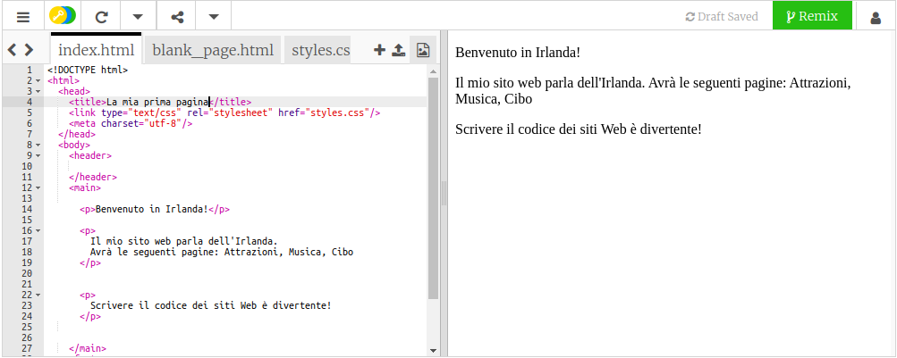

## Prepararsi

- Vai a [il gingillo di avviamento](http://dojo.soy/html-b-start). Verrà visualizzata una casella contenente un progetto di sito Web di esempio. Sul lato destro c'è il sito web e sul lato sinistro c'è il codice che rende il sito. 

## \--- chiudi \---

## titolo: ho un account Trinket

- Fai clic sul pulsante **Remix** in alto a destra del progetto. Se non hai effettuato l'accesso, ti verrà richiesto di farlo. Dopo aver effettuato l'accesso, dovrai fare nuovamente clic su **Remix**. Facendo clic su questo pulsante si crea una copia del progetto con cui lavorare. 

Dovrebbe dire **remixato** dopo aver fatto clic su di esso:

\--- / chiudi \---

## \--- chiudi \---

## titolo: non ho un account Trinket

Puoi salvare il tuo lavoro utilizzando una delle opzioni nel menu **Condividi**. Otterrai un link che puoi salvare da qualche parte, ad esempio in un documento, o inviarlo a qualcuno via email. **Nota:** ogni volta che apporti una modifica, riceverai un nuovo link.

Se vuoi creare un account su Trinket, procedi nel seguente modo. Questo vi permetterà di accedere al tuo lavoro con facilità da qualsiasi computer, e per **remix** progetti qualcun altro ha condiviso con te. Remixing significa che salvi una copia di un progetto in modo da poter apportare le tue modifiche ad esso.

- Vai a [il sito Web di Trinket](http://dojo.soy/trinket) e fai clic su **Registrati per il tuo account gratuito**. Avrai bisogno di un indirizzo email per iscriverti.

- Inserisci il tuo indirizzo email e scegli una password, o chiedi a qualcuno di farlo per te.

- Ora puoi accedere a tutti i progetti salvati o remixati facendo clic sul tuo nome utente e andando su **My Trinkets**. 

\--- / chiudi \---

Iniziamo la codifica!